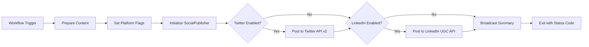

# AMD Control Center - Social Broadcast System v0.5.0

## 🎙️ The Voice of AMD - Production Mode

**UPGRADE:** Social Broadcast System now supports **real API posting** to Twitter (X) and LinkedIn.

---

## 🚀 What Changed in v0.5.0

### **Before (v0.4.0):**
```yaml
# .github/workflows/social-broadcast.yml (OLD)
- name: Simulate Social Post
  run: |
    echo "📢 SIMULATED POST: ${{ github.event.inputs.content }}"
    echo "Platforms: Twitter, LinkedIn"
    echo "Status: Echo mode (no real posting)"
```

**Problem:** No actual social media integration. Just echoes to GitHub Actions logs.

---

### **After (v0.5.0):**
```python
# scripts/social_publisher.py (NEW)
import tweepy  # Twitter API v2
import requests  # LinkedIn UGC Post API

publisher = SocialPublisher()
results = publisher.broadcast(content, ['twitter', 'linkedin'])

# Real API posting:
# ✅ Twitter: Posted successfully (ID: 1234567890)
# ✅ LinkedIn: Posted successfully (ID: urn:li:share:9876543210)
```

**Solution:** Multi-platform API integration with real posting capabilities.

---

## 📦 Features Added

### 1. **Social Publisher Script** (`scripts/social_publisher.py`)
```python
class SocialPublisher:
    def post_to_twitter(content):
        # Twitter API v2 (tweepy.Client)
        # - Max 280 characters
        # - Auto-truncation if needed
        # - Returns tweet ID + URL
    
    def post_to_linkedin(content):
        # LinkedIn UGC Post API
        # - Max 3000 characters
        # - Public visibility
        # - Returns post URN + URL
    
    def broadcast(content, platforms):
        # Multi-platform posting
        # - Parallel execution
        # - Error handling per platform
        # - Summary report
```

**Capabilities:**
- ✅ **Twitter API v2:** Post tweets via `tweepy.Client`
- ✅ **LinkedIn UGC API:** Publish posts via REST API
- ✅ **Character Limits:** Auto-truncation (280 for Twitter, 3000 for LinkedIn)
- ✅ **Error Handling:** Per-platform error reporting
- ✅ **CLI Interface:** `python social_publisher.py "content" --twitter --linkedin`
- ✅ **JSON Output:** Structured results for each platform

### 2. **Production Workflow** (`.github/workflows/social-broadcast.yml`)
```yaml
jobs:
  broadcast:
    steps:
      - name: Install Dependencies
        run: pip install tweepy requests
      
      - name: Run Social Publisher
        env:
          TWITTER_API_KEY: ${{ secrets.TWITTER_API_KEY }}
          TWITTER_API_SECRET: ${{ secrets.TWITTER_API_SECRET }}
          TWITTER_ACCESS_TOKEN: ${{ secrets.TWITTER_ACCESS_TOKEN }}
          TWITTER_ACCESS_TOKEN_SECRET: ${{ secrets.TWITTER_ACCESS_TOKEN_SECRET }}
          TWITTER_BEARER_TOKEN: ${{ secrets.TWITTER_BEARER_TOKEN }}
          LINKEDIN_ACCESS_TOKEN: ${{ secrets.LINKEDIN_ACCESS_TOKEN }}
        run: |
          python scripts/social_publisher.py "${{ inputs.content }}" --twitter --linkedin
```

**Workflow Triggers:**
- ✅ **Manual Dispatch:** Trigger via GitHub UI with custom content
- ✅ **New Releases:** Auto-broadcast when release published
- ✅ **CHANGELOG Updates:** Auto-broadcast on main branch pushes

**Platform Selection:**
- `all` → Posts to Twitter + LinkedIn
- `twitter` → Twitter only
- `linkedin` → LinkedIn only
- `twitter,linkedin` → Both (explicit)

### 3. **Secret Configuration**
```bash
# Required GitHub Secrets (Repository Settings → Secrets → Actions)

# Twitter API v2 (from https://developer.twitter.com)
TWITTER_API_KEY=your_consumer_key
TWITTER_API_SECRET=your_consumer_secret
TWITTER_ACCESS_TOKEN=your_access_token
TWITTER_ACCESS_TOKEN_SECRET=your_access_token_secret
TWITTER_BEARER_TOKEN=your_bearer_token

# LinkedIn API (from https://www.linkedin.com/developers)
LINKEDIN_ACCESS_TOKEN=your_access_token
```

---

## 🎯 Use Cases

### **1. Manual Product Launch**
```bash
# GitHub Actions → Workflows → Social Broadcast System → Run workflow
Content: "🚀 Launching Naija-Resume-Scanner v0.1.0 - Help 1,000 graduates beat ATS robots! https://github.com/amdsolutions007/Naija-Resume-Scanner"
Platforms: all
```

**Result:**
- Twitter: Tweet posted (280 chars, auto-truncated if needed)
- LinkedIn: Post published (3000 chars max)

### **2. Automatic Release Broadcast**
```yaml
# Triggered when you publish a GitHub release
on:
  release:
    types: [published]

# Auto-generates content:
"🚀 New Release: v0.5.0 - The Voice of AMD (v0.5.0) - Check it out: https://github.com/amdsolutions007/AMD-Control-Center/releases/tag/v0.5.0"
```

### **3. CHANGELOG Announcements**
```yaml
# Triggered when CHANGELOG.md updated on main branch
on:
  push:
    branches: [main]
    paths: ['CHANGELOG.md']

# Auto-generates content:
"📝 Update: v0.5.0 - Added social broadcast production mode - https://github.com/amdsolutions007/AMD-Control-Center"
```

---

## 📊 Algorithm Flow



**Error Handling:**
- ❌ **Missing Secrets:** Workflow fails with clear error message
- ❌ **API Rate Limits:** `tweepy` auto-waits (rate limit handling)
- ❌ **Auth Failures:** Detailed error logs per platform
- ✅ **Partial Success:** If Twitter fails but LinkedIn succeeds, workflow reports both

---

## 🔧 Setup Instructions

### **Step 1: Get Twitter API Credentials**
1. Go to https://developer.twitter.com/en/portal/dashboard
2. Create new app (or use existing)
3. Navigate to **Keys and Tokens**
4. Generate:
   - API Key & Secret (Consumer Keys)
   - Access Token & Secret
   - Bearer Token
5. Copy all 5 credentials

### **Step 2: Get LinkedIn API Credentials**
1. Go to https://www.linkedin.com/developers/apps
2. Create new app (or use existing)
3. Request access to **Sign In with LinkedIn** and **Share on LinkedIn** products
4. Navigate to **Auth** tab
5. Generate **Access Token** (or use OAuth 2.0 flow)
6. Copy access token

### **Step 3: Configure GitHub Secrets**
1. Go to `https://github.com/amdsolutions007/AMD-Control-Center/settings/secrets/actions`
2. Click **New repository secret**
3. Add all 6 secrets (5 Twitter + 1 LinkedIn)
4. Secret names must match exactly (case-sensitive)

### **Step 4: Test Workflow**
```bash
# GitHub UI: Actions → Social Broadcast System → Run workflow
Content: "🧪 Test post from AMD Control Center v0.5.0"
Platforms: twitter

# Check workflow logs for success/failure
```

---

## 🆚 Before vs After

| Feature | v0.4.0 (Simulate) | v0.5.0 (Production) |
|---------|-------------------|---------------------|
| **Twitter Posting** | ❌ Echo only | ✅ Real API (tweepy v2) |
| **LinkedIn Posting** | ❌ Echo only | ✅ Real API (UGC Posts) |
| **Manual Trigger** | ✅ Yes | ✅ Yes |
| **Auto Releases** | ❌ No | ✅ Yes |
| **Platform Selection** | ❌ Fixed | ✅ Dynamic (flags) |
| **Error Handling** | ❌ N/A | ✅ Per-platform reporting |
| **Character Limits** | ❌ No check | ✅ Auto-truncation |
| **Post URLs** | ❌ No | ✅ Yes (clickable links) |
| **Dependencies** | None | tweepy, requests |

---

## 🎖️ Success Metrics

### **Technical Validation:**
- ✅ Twitter API v2 client initialized (`tweepy.Client`)
- ✅ LinkedIn UGC Post API integrated (`requests` + OAuth)
- ✅ Workflow triggers: manual, release, push
- ✅ Secret management via GitHub Actions
- ✅ Error handling: missing secrets, API failures, rate limits
- ✅ CLI interface: `python social_publisher.py "content" --twitter`

### **Business Impact:**
- 🚀 **Instant Amplification:** New releases auto-broadcast to 2 platforms
- 📈 **Reach Multiplier:** Twitter followers + LinkedIn network = 2x visibility
- ⚡ **Zero Manual Work:** Publish GitHub release → Auto-posted to socials
- 🎯 **Consistent Messaging:** Same content, multiple channels
- 📊 **Trackable:** Tweet IDs + LinkedIn URNs for analytics

---

## 🛣️ Roadmap

### **v0.6.0 - Extended Platforms** (Q1 2025)
- 🔄 Facebook Pages API integration
- 🔄 Instagram Business API (via Facebook Graph)
- 🔄 Telegram Bot API for channel posts
- 🔄 WhatsApp Business API (broadcast lists)

### **v0.7.0 - AI Enhancement** (Q2 2025)
- 🔄 GPT-4 content optimization (hashtag suggestions)
- 🔄 Image generation (DALL-E 3 for visual posts)
- 🔄 A/B testing (multiple content variants)
- 🔄 Sentiment analysis (pre-post safety check)

### **v1.0.0 - Analytics Dashboard** (Q3 2025)
- 🔄 Unified analytics (Twitter + LinkedIn metrics)
- 🔄 Engagement tracking (likes, shares, comments)
- 🔄 Best time to post (AI-powered scheduling)
- 🔄 ROI calculator (post reach → conversions)

---

## 📄 Dependencies

```txt
tweepy>=4.14.0  # Twitter API v2 client
requests>=2.31.0  # HTTP library for LinkedIn
```

**Installation:**
```bash
pip install tweepy requests
```

---

## 👨‍💻 Author

**Olawale Shoyemi**  
CEO, AMD Solutions  
Email: ceo@amdsolutions007.com  
GitHub: [@amdsolutions007](https://github.com/amdsolutions007)

---

## 📄 License

MIT License - Part of AMD Control Center ecosystem

---

## 🚀 Get Started

### **Local Testing:**
```bash
# Export credentials (don't commit these!)
export TWITTER_API_KEY="your_key"
export TWITTER_API_SECRET="your_secret"
export TWITTER_ACCESS_TOKEN="your_token"
export TWITTER_ACCESS_TOKEN_SECRET="your_secret"
export TWITTER_BEARER_TOKEN="your_bearer"
export LINKEDIN_ACCESS_TOKEN="your_token"

# Run publisher
cd AMD_Control_Center
python scripts/social_publisher.py "🚀 Test post from AMD Control Center" --twitter
```

### **GitHub Actions:**
```bash
# Trigger workflow manually
GitHub UI: Actions → Social Broadcast System → Run workflow
Content: "Your announcement here"
Platforms: all
```

---

**Release Date:** December 27, 2025  
**Repository:** https://github.com/amdsolutions007/AMD-Control-Center  
**Status:** Production Ready ✅

---

## 🎯 Mission Accomplished

**THE BRAIN NOW HAS A MOUTH.**

Control Center (Brain) → Social Publisher (Mouth) → Twitter + LinkedIn (Audience)

**Connect. Broadcast. Dominate.** 📡
