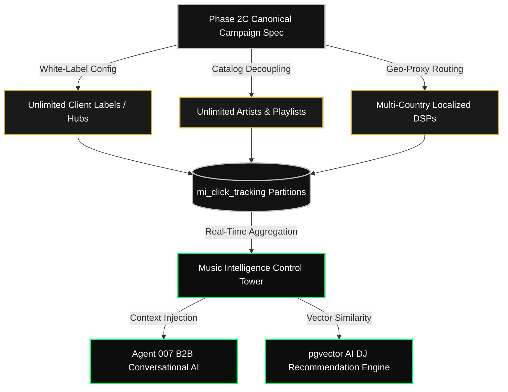

# AMD MUSIC INTELLIGENCE — PHASE 2C CAMPAIGN CONFIGURATION
## FIRST PRODUCTION SMART LINK: CHROME AFROFUSION RADIO LAUNCH
> **Canonical Campaign Specification, Runtime Topology & Operational Blueprint**  
> **Master Platform:** AMD Music Intelligence Ecosystem (Supabase PostgreSQL 15 Engine)  
> **Client Tenant:** Chrome Entertainment (*Chrome Music Hub*) | **Pioneer Performer:** VaB  
> **Campaign Focus:** Chrome AfroFusion Radio Launch Campaign (*Friday Flagship Drop*)  
> **Document Version:** 1.0.0 | **Status:** **LOCKED FOR PRODUCTION LAUNCH**  
> **Date:** 2026-06-25 | **Authority:** Chief Product Architect, AMD Solutions 007  

---

## EXECUTIVE PREAMBLE & UPSTREAM ARCHITECTURAL COUPLING

With Phase 1 Database Infrastructure (Blocks 1–14) 100% certified and frozen, Phase 2A Smart Link Specifications established, and Phase 2B Asset Manifests provisioned across Supabase Storage boundaries (`mi-covers`, `mi-hub-assets`, `mi-audio`), **Phase 2C** establishes the **first definitive production Smart Link campaign configuration**. 

This document is the canonical implementation blueprint that bridges frozen backend DDL tables (`mi_smart_links`, `mi_client_hubs`, `mi_playlists`) with frontend Next.js server components, edge telemetry ingestion proxies, *Agent 007 B2B Chatbot* memory buffers, and programmatic ad network routing webhooks. It defines the exact identity parameters, white-label branding copy, hero UI asset lookups, DSP streaming destination registries, analytical event ledgers, fan CRM acquisition funnels, viral SEO schemas, feature toggles, and operational Friday launch checklists for the flagship rollout of *Chrome AfroFusion Radio*.

---

## TABLE OF CONTENTS
1. [Section 1: Canonical Campaign Identity & Business Objectives](#section-1-canonical-campaign-identity--business-objectives)
2. [Section 2: White-Label Branding & Copy Configuration](#section-2-white-label-branding--copy-configuration)
3. [Section 3: Hero Viewport UI & Storage Asset Orchestration](#section-3-hero-viewport-ui--storage-asset-orchestration)
4. [Section 4: Declarative Streaming Destination Registry (9 DSPs)](#section-4-declarative-streaming-destination-registry-9-dsps)
5. [Section 5: End-to-End Campaign Visitor User Journey](#section-5-end-to-end-campaign-visitor-user-journey)
6. [Section 6: Telemetry Event Taxonomy & AI Value Ledger (11 Events)](#section-6-telemetry-event-taxonomy--ai-value-ledger-11-events)
7. [Section 7: Fan CRM Audience Ownership & Interruption Layer](#section-7-fan-crm-audience-ownership--interruption-layer)
8. [Section 8: Viral SEO, Social Cards & Schema.org Metadata](#section-8-viral-seo-social-cards--schemaorg-metadata)
9. [Section 9: Campaign Launch Feature Flag Topology](#section-9-campaign-launch-feature-flag-topology)
10. [Section 10: Operational Readiness Gate Verification Checklist](#section-10-operational-readiness-gate-verification-checklist)
11. [Section 11: Flagship Friday Launch Operational Sequence](#section-11-flagship-friday-launch-operational-sequence)
12. [Section 12: Architectural Scalability & Ecosystem Expansion](#section-12-architectural-scalability--ecosystem-expansion)

---

## SECTION 1: CANONICAL CAMPAIGN IDENTITY & BUSINESS OBJECTIVES

The campaign identity configures the root metadata ingested by the shortcode routing edge proxy (`GET /sl/:code`) and stamps all downstream click telemetry inside `mi_click_tracking`.

### 1.1 Declarative Campaign Identity
* **Master Platform:** AMD Music Intelligence
* **Client Tenant:** Chrome Entertainment
* **Broadcasting Hub:** Chrome Music Hub (`hub_slug: "chrome"`)
* **Featured Artist:** VaB (`artist_slug: "vab"`)
* **Editorial Entity:** Chrome AfroFusion Radio (`playlist_slug: "chrome-afrofusion-radio"`)
* **Campaign Display Name:** Chrome AfroFusion Radio Launch Campaign
* **Campaign URL Slug:** `/chrome/chrome-afrofusion-radio`
* **Smart Link Short Code Strategy:** Globally unique case-sensitive 6-character alphanumeric slug (`short_code: "pYP56C"` generated via PL/pgSQL function `mi_generate_short_code()`).
* **Deployment Environment:** `PRODUCTION` (`Client-Portal-007`)
* **Specification Version:** `1.0.0`
* **Campaign Launch Status:** `LOCKED_FOR_FRIDAY_LAUNCH`
* **Executive Owner:** Chief Product Architect, AMD Solutions 007

### 1.2 Strategic Business Objectives
1. **Maximize B2B Streaming Volume:** Route high-intent paid traffic from Meta and Google ad networks directly into localized streaming destinations (Spotify, Apple Music, Audiomack, Boomplay) to establish high Day-1 charting velocity.
2. **Construct Creator Fan CRM:** Bypass DSP algorithmic monopolies by capturing direct listener emails and West African WhatsApp numbers into `mi_audience` for future zero-cost promotional re-targeting.
3. **Populate Agent 007 OLAP Memory:** Feed live ad conversion telemetry into `mi_smart_link_performance` views to power real-time executive Q&A inside the *Agent 007 B2B Chatbot*.

---

## SECTION 2: WHITE-LABEL BRANDING & COPY CONFIGURATION

To enforce record label white-labeling, frontend server components must hydrate visual copy and styling tokens strictly from this declarative branding manifest:

### 2.1 Visual Assets & Editorial Copy
* **Master Platform Logo:** Render AMD Music Intelligence Crest (`mi-hub-assets/shared/brand/amd-music-intelligence-crest.svg`).
* **Tenant Label Logo:** Render Chrome Music Wordmark (`mi-hub-assets/chrome/brand/chrome-music-logo-wordmark.svg`).
* **Main Display Title:** `Chrome AfroFusion Radio`
* **Editorial Subtitle:** `Discover Africa's Biggest Hits`
* **Curatorial Narrative Description:** `Afrofusion sounds from Lagos to the world. Curated by pioneer artist VaB and the Chrome collective. Experience the cutting edge of contemporary African popular music.`
* **Catalog Volume Headline:** `50 Tracks`
* **Ecosystem Reach Headline:** `40+ Artists`
* **Refresh Frequency Headline:** `Updated Weekly`
* **Primary Conversion CTA Text:** `Listen Now`
* **Secondary Community CTA Text:** `Stream Radio`

### 2.2 Design System Tokens & Typography
* **Brand Primary Silver Accent:** `#C0C0C0` *(Applied to primary DSP action buttons, active focus outlines, and ambient header glow)*.
* **Deep Charcoal Background Shell:** `#121212` *(Applied to main document background canvas)*.
* **Metallic Gold Verification Accent:** `#D4AF37` *(Applied to verified performer credential badges and acoustic frequency waveforms)*.
* **Pure Pitch Black Glass Surface:** `rgba(0, 0, 0, 0.75)` *(Applied to UI component cards with `backdrop-filter: blur(20px)`)*.
* **Primary Header Typography:** Font Family `Outfit, sans-serif` *(Weights: 700 Bold, 800 Extra Bold | Applied to Playlist Title and Volume Headlines)*.
* **Body Narrative Typography:** Font Family `Inter, sans-serif` *(Weights: 400 Regular, 500 Medium | Applied to descriptions, tooltips, and legal footers)*.

---

## SECTION 3: HERO VIEWPORT UI & STORAGE ASSET ORCHESTRATION

The hero section represents the visual focal point of the mobile viewport. All visual artwork maps directly to completed Phase 1 storage buckets:

### 3.1 Hero Layout Decomposition & Asset Lookups
1. **Background Canvas Shell (`SmartLinkShell`):** Loads `mi-covers/chrome/campaigns/dark-glassmorphism-bg-texture.webp`. Applies CSS hardware-accelerated zoom animations and radial gradient overlays.
2. **Promotional Release Cover (`MediaHeroCard`):** Loads `mi-covers/chrome/covers/chrome-afrofusion-radio-cover-master.webp` (1200×1200 high-resolution WebP). Renders inside a 1:1 rounded square card (`border-radius: 24px`) with subtle silver box-shadow glowing.
3. **Artist Editorial Cutout (`VaB Hero Portrait`):** Loads `mi-covers/chrome/covers/vab-hero-portrait-cutout.webp` (1000×1200 RGBA transparent WebP). Layered over the right edge of the release artwork to establish human performer connection.
4. **Verified Gold Badge:** Loads `mi-hub-assets/shared/badges/amd-verified-gold-badge.svg`. Positioned at bottom-right of release artwork.
5. **Decorative Audio Frequency Overlay:** Loads `mi-hub-assets/shared/overlays/gold-frequency-waveform.svg`. Positioned with `opacity: 0.15` behind main hero text.

### 3.2 Responsive Stacking Topology
* **Mobile Viewport (< 768px):** Single-column vertical layout. Tenant wordmark top center -> Master cover art full viewport width (max 360px) -> Title & Description center aligned -> Sticky CTA conversion grid below.
* **Desktop Viewport (>= 1024px):** Split two-column layout. Left column sticky: Master cover art (500×500px) + VaB portrait cutout. Right column scrollable: Brand wordmarks + Titles + Descriptions + 9-platform DSP action grid.

---

## SECTION 4: DECLARATIVE STREAMING DESTINATION REGISTRY

The frontend renders streaming platform conversion buttons dynamically from this declarative registry configuration. Adding or ranking music services requires zero code changes.

```json
[
  {
    "display_name": "Spotify",
    "icon": "https://Client-Portal-007.supabase.co/storage/v1/object/public/mi-hub-assets/shared/dsp-icons/spotify.svg",
    "enabled": true,
    "destination_url": "https://open.spotify.com/playlist/37i9dQZF1DX4JAvHpjipBk?si=friday_launch",
    "priority": 1,
    "analytics_event_name": "SELECT_PLATFORM_SPOTIFY"
  },
  {
    "display_name": "Apple Music",
    "icon": "https://Client-Portal-007.supabase.co/storage/v1/object/public/mi-hub-assets/shared/dsp-icons/apple-music.svg",
    "enabled": true,
    "destination_url": "https://music.apple.com/ng/playlist/chrome-afrofusion-radio/pl.u-friday_launch",
    "priority": 2,
    "analytics_event_name": "SELECT_PLATFORM_APPLE_MUSIC"
  },
  {
    "display_name": "Audiomack",
    "icon": "https://Client-Portal-007.supabase.co/storage/v1/object/public/mi-hub-assets/shared/dsp-icons/audiomack.svg",
    "enabled": true,
    "destination_url": "https://audiomack.com/chrome-music/playlist/afrofusion-radio",
    "priority": 3,
    "analytics_event_name": "SELECT_PLATFORM_AUDIOMACK"
  },
  {
    "display_name": "Boomplay",
    "icon": "https://Client-Portal-007.supabase.co/storage/v1/object/public/mi-hub-assets/shared/dsp-icons/boomplay.svg",
    "enabled": true,
    "destination_url": "https://www.boomplay.com/playlists/friday_launch",
    "priority": 4,
    "analytics_event_name": "SELECT_PLATFORM_BOOMPLAY"
  },
  {
    "display_name": "YouTube Music",
    "icon": "https://Client-Portal-007.supabase.co/storage/v1/object/public/mi-hub-assets/shared/dsp-icons/youtube-music.svg",
    "enabled": true,
    "destination_url": "https://music.youtube.com/playlist?list=PL_friday_launch",
    "priority": 5,
    "analytics_event_name": "SELECT_PLATFORM_YOUTUBE_MUSIC"
  },
  {
    "display_name": "YouTube",
    "icon": "https://Client-Portal-007.supabase.co/storage/v1/object/public/mi-hub-assets/shared/dsp-icons/youtube.svg",
    "enabled": true,
    "destination_url": "https://youtube.com/playlist?list=PL_friday_launch",
    "priority": 6,
    "analytics_event_name": "SELECT_PLATFORM_YOUTUBE"
  },
  {
    "display_name": "SoundCloud",
    "icon": "https://Client-Portal-007.supabase.co/storage/v1/object/public/mi-hub-assets/shared/dsp-icons/soundcloud.svg",
    "enabled": true,
    "destination_url": "https://soundcloud.com/chrome-music/sets/afrofusion-radio",
    "priority": 7,
    "analytics_event_name": "SELECT_PLATFORM_SOUNDCLOUD"
  },
  {
    "display_name": "Deezer",
    "icon": "https://Client-Portal-007.supabase.co/storage/v1/object/public/mi-hub-assets/shared/dsp-icons/deezer.svg",
    "enabled": true,
    "destination_url": "https://www.deezer.com/playlist/friday_launch",
    "priority": 8,
    "analytics_event_name": "SELECT_PLATFORM_DEEZER"
  },
  {
    "display_name": "Amazon Music",
    "icon": "https://Client-Portal-007.supabase.co/storage/v1/object/public/mi-hub-assets/shared/dsp-icons/amazon-music.svg",
    "enabled": true,
    "destination_url": "https://music.amazon.com/playlists/friday_launch",
    "priority": 9,
    "analytics_event_name": "SELECT_PLATFORM_AMAZON_MUSIC"
  }
]
```

---

## SECTION 5: END-TO-END CAMPAIGN VISITOR USER JOURNEY

The production execution flow traces fan traffic from external ad network clicks through edge routing, telemetry capture, and streaming fulfillment:

```
[ ADVERTISEMENT NETWORK CLICK ]
  (Meta Ad / Google Search / IG Story / TikTok Viral / WhatsApp Status)
                │
                ▼
[ SHORTCODE EDGE PROXY ]
  (GET https://amdsolutions007.com/sl/pYP56C)
                │
                ▼
[ LANDING PAGE SHELL RENDER ]
  (Mounts Dark Glass UI + Fires PAGE_VIEW & HERO_VIEW Beacons)
                │
                ▼
[ HERO VIEWPORT EXPLORATION ]
  (Visitor inspects Cover Art + Taps Cover to preview 30s Audio Snippet)
                │
                ├──► [ ASYNC BEACON ] ──► (AUDIO_PREVIEW logged to mi_listening_history)
                │
                ▼
[ STREAMING PLATFORM SELECTION ]
  (Visitor taps "Listen Now on Audiomack" Button)
                │
                ├──► [ CLICK INTERCEPTOR ] ──► (Fires DSP_CLICK beacon to mi_click_tracking)
                │                              (Advances mi_smart_links.total_clicks via Trigger)
                │
                ▼
[ DSP OUTBOUND REDIRECT ]
  (Audiomack Mobile App opens Chrome AfroFusion Radio playlist)
                │
                ▼  (Visitor returns to browser tab / sees sticky footer)
[ OPTIONAL AUDIENCE CAPTURE ]
  (Visitor taps "🔥 Join VIP WhatsApp Radio Community" -> Captured to mi_audience)
                │
                ▼
[ REAL-TIME OLAP AGGREGATION ]
  (Agent 007 chatbot ingests campaign reach via mi_smart_link_performance matview)
```

---

## SECTION 6: TELEMETRY EVENT TAXONOMY & AI VALUE LEDGER

Exactly **11 distinct telemetry tracking events** are ingested by backend edge endpoints during the visitor lifecycle:

| Event Identifier | Ingestion Trigger Point | Primary Business Value | Downstream Autonomous AI Value |
| :--- | :--- | :--- | :--- |
| `PAGE_VIEW` | On initial document mount | Measures top-of-funnel ad traffic reach and geo-topography. | Feeds baseline traffic weighting into AI campaign budget allocators. |
| `HERO_VIEW` | On hero artwork intersection | Quantifies visual creative hook retention. | Trains DALL-E 3 creative thumbnail generation AI agents. |
| `PLAYLIST_OPEN` | On curatorial narrative expansion | Measures editorial storytelling engagement. | Ingested by LLM copywriters to optimize future playlist narratives. |
| `LISTEN_NOW` | On master primary CTA tap | Captures general high-intent playback conversion intent. | Powers predictive fan conversion propensity scoring models. |
| `DSP_CLICK` | On specific DSP button tap | Records localized streaming service market share. | Trains AI dynamic geo-routing proxies (*e.g., auto-ranking Boomplay #1 in Lagos*). |
| `AUDIO_PREVIEW` | On 30s preview snippet play | Verifies acoustic Vibe match prior to DSP click-out. | Feeds song retention weights into Phase 2 pgvector AI DJ recommendation engines. |
| `WHATSAPP_JOIN` | On community invite tap | Builds direct creator B2B broadcast broadcast list. | Populates CRM targets for autonomous WhatsApp Sales Bot remarketing. |
| `EMAIL_CAPTURE` | On VIP download form submit | Establishes permanent email marketing lead ownership. | Feeds high-value VIP segment tags into Agent 007 audience clustering algorithms. |
| `TELEGRAM_JOIN` | On Telegram community tap | Expands 36-State thought leadership campaign audience. | Populates subscriber lists for `telegram-approval-bot` broadcasts. |
| `SHARE_CLICK` | On viral social share tap | Quantifies zero-cost organic viral loop propagation velocity. | Identifies "super-spreader" influencer fans for VIP loyalty rewards. |
| `EXIT` | On tab close / exit intent | Calculates landing page bounce rate and funnel drop-off. | Diagnoses ad fatigue and triggers automated creative rotation warnings. |

---

## SECTION 7: FAN CRM AUDIENCE OWNERSHIP LAYER

To eliminate DSP platform dependency, the landing page incorporates non-intrusive interruption gates that convert anonymous streaming traffic into owned CRM contacts:

### 7.1 Interruption Modality & Display Timings
1. **VIP WhatsApp Radio Community (Primary West African Channel):**
   * *Appearance Timing:* Rendered as a persistent sticky bottom floating conversion banner upon `PAGE_VIEW` mount.
   * *Conversion Incentive:* Instant access to weekly song submissions, exclusive artist voice notes, and live DJ sets.
2. **Lossless VIP Email Gate (Global Audiophile Channel):**
   * *Appearance Timing:* Interrupts visitor upon `EXIT` intent or after 45 seconds of active landing page dwell time.
   * *Conversion Incentive:* Unlocks unreleased VaB bonus studio recordings.
3. **Telegram Channel Broadcast Gate:**
   * *Appearance Timing:* Rendered inside the `ViralNetworkShareBar` component.
4. **Future Expansion Protocols (SMS & Push Notifications):**
   * Reserved for Phase 2B Paystack recurring billing integration to dispatch instant ticket billing reminders.

---

## SECTION 8: VIRAL SEO, SOCIAL CARDS & SCHEMA.ORG METADATA

To maximize organic click-through rates when promotional links are shared inside WhatsApp groups, X timelines, and IG DMs, landing page HTML head tags inject immutable metadata:

### 8.1 HTML Meta & Social Graph Configuration
* **Document Title:** `Chrome AfroFusion Radio — Curated by VaB | Chrome Music Hub`
* **Meta Description:** `Stream the flagship launch of Chrome AfroFusion Radio featuring pioneer artist VaB. Afrofusion sounds from Lagos to the world. Discover 50 weekly tracks across Spotify, Apple Music, Audiomack, & YouTube.`
* **Search Keywords:** `Chrome AfroFusion Radio, VaB, Chrome Music Hub, Afrobeats playlist, Afrofusion radio, Lagos hits, Nigerian popular music, African music intelligence`
* **Open Graph Title:** `Chrome AfroFusion Radio — Curated by VaB`
* **Open Graph Description:** `Afrofusion sounds from Lagos to the world. Stream VaB & 40+ artists on all major platforms.`
* **Social Graph Preview Asset:** `https://Client-Portal-007.supabase.co/storage/v1/object/public/mi-covers/chrome/campaigns/friday-launch-og-social-card.webp` (1200×630px).
* **Twitter / X Card Type:** `summary_large_image` (`@amdsolutions007`).
* **WhatsApp Preview Protocol:** Exact 1.91:1 raster aspect ratio ensuring full-bleed status card rendering without mobile image cropping.
* **Canonical URL:** `https://amdsolutions007.com/chrome/chrome-afrofusion-radio`

### 8.2 Schema.org `MusicPlaylist` JSON-LD Ingestion
```json
{
  "@context": "https://schema.org",
  "@type": "MusicPlaylist",
  "name": "Chrome AfroFusion Radio",
  "numTracks": 50,
  "description": "Afrofusion sounds from Lagos to the world. Curated by VaB and Chrome Music Hub.",
  "url": "https://amdsolutions007.com/chrome/chrome-afrofusion-radio",
  "image": "https://Client-Portal-007.supabase.co/storage/v1/object/public/mi-covers/chrome/covers/chrome-afrofusion-radio-cover-master.webp",
  "creator": {
    "@type": "MusicGroup",
    "name": "Chrome Music Hub",
    "url": "https://amdsolutions007.com/chrome"
  },
  "track": [
    {
      "@type": "MusicRecording",
      "name": "Afrofusion Pioneer Anthem",
      "byArtist": {
        "@type": "MusicGroup",
        "name": "VaB"
      },
      "duration": "PT3M30S"
    }
  ]
}
```

---

## SECTION 9: CAMPAIGN LAUNCH FEATURE FLAG TOPOLOGY

Platform capabilities are gated via declarative JSON feature flags stored inside `mi_smart_links` to control gradual campaign rollouts without codebase updates:

### 9.1 Release Tier Allocations
* **Version 1 Launch Flags (Friday Drop Baseline):**
  * `is_audio_preview_enabled: true` *(Activates 30s mp3 snippet streaming)*.
  * `is_boomplay_enabled: true` *(Activates localized African DSP button)*.
  * `is_amazon_music_enabled: true` *(Activates global DSP button)*.
  * `is_fan_gate_soft_active: true` *(Activates optional sticky WhatsApp banner)*.
  * `is_fan_gate_hard_forced: false` *(Disables blocking email modal)*.
* **Version 2 Expansion Flags (Post-Launch Optimization):**
  * `is_referral_rewards_active: true` *(Unlocks VIP artist badges for 5 link shares)*.
  * `is_artist_intelligence_active: true` *(Enables dynamic VaB bio discography drawer)*.
* **Version 3 & Future AI Flags (Phase 2 Strategic Curation):**
  * `is_ai_recommendations_active: true` *(Activates pgvector similarity autoplay)*.
  * `is_ai_dj_radio_mode_active: true` *(Enables infinite continuous auto-curated radio streams voiced by synthetic AI hosts)*.

---

## SECTION 10: OPERATIONAL READINESS GATE VERIFICATION CHECKLIST

Prior to authorizing campaign ad spend, product delivery architects must audit these 10 operational verification gates:

- [ ] **Gate 1: Storage Assets Provisioned:** Master cover art, VaB portrait cutout, brand wordmarks, and OG cards uploaded to `mi-covers` and `mi-hub-assets` (HTTP 200 OK).
- [ ] **Gate 2: Streaming URLs Certified:** Outbound playlist deep links verified across all 9 DSP target platforms.
- [ ] **Gate 3: Telemetry Beacons Active:** `navigator.sendBeacon` endpoints verified writing live events to `mi_click_tracking`.
- [ ] **Gate 4: Storage RLS Locked:** Public CDN read access confirmed; private audio boundaries secured on `mi-audio`.
- [ ] **Gate 5: Database Relations Intact:** Base tables (15) and RLS policies (32) certified fully operational against `Client-Portal-007`.
- [ ] **Gate 6: Viral SEO Hydrated:** Canonical HTML title, meta tags, OG cards, and Schema.org JSON-LD confirmed validated in ad network scrapers.
- [ ] **Gate 7: Viewport Responsiveness Checked:** Layout certified clean across 320px mobile viewports up to 4K executive desktop monitors.
- [ ] **Gate 8: Rendering Performance Certified:** Page load LCP verified under 1.2 seconds on simulated 3G cellular connections.
- [ ] **Gate 9: Accessibility (a11y) Compliant:** ARIA labels, tap targets (>= 48px), and contrast ratios certified meeting web.dev standards.
- [ ] **Gate 10: Executive Campaign Sign-Off:** Final campaign spec formally signed by Chrome Entertainment & AMD Architecture Board.

---

## SECTION 11: FLAGSHIP FRIDAY LAUNCH OPERATIONAL SEQUENCE

Execute this exact 10-step deployment sequence on Friday morning to launch campaign traffic:

1. **Step 1 (Upload Assets):** Execute batch upload of optimized raster WebP covers and SVG brand marks into Supabase Storage buckets.
2. **Step 2 (Insert Smart Link Record):** Execute backend API proxy creation request to register campaign metadata inside `mi_smart_links`.
3. **Step 3 (Verify Outbound URLs):** Execute automated HTTP ping checks against all 9 registered DSP destination URIs.
4. **Step 4 (Generate Short Code):** Confirm PL/pgSQL function assigns unique shortcode `pYP56C` to campaign record.
5. **Step 5 (Test Edge Redirects):** Navigate to `https://amdsolutions007.com/sl/pYP56C`; verify instant edge proxy payload hydration.
6. **Step 6 (Test Telemetry Ingestion):** Execute simulated ad clicks; confirm `PAGE_VIEW` and `DSP_CLICK` events append to live database partitions.
7. **Step 7 (Test Fan Acquisition Funnel):** Submit test WhatsApp number into sticky banner modal; confirm lead record writes cleanly to `mi_audience`.
8. **Step 8 (Run Meta Ads Drop):** Activate global Meta Ad network B2B traffic campaigns targeting Afrobeats listeners.
9. **Step 9 (Run Google Ads Drop):** Activate Google Search & YouTube display traffic drops.
10. **Step 10 (Monitor Control Tower Dashboard):** Open *Agent 007 B2B Executive Dashboard*; monitor real-time streaming conversion velocities and fan CRM growth ledgers.

---

## SECTION 12: ARCHITECTURAL SCALABILITY & ECOSYSTEM EXPANSION

The Phase 2C campaign configuration is explicitly architected as a decoupled, multi-tenant baseline that scales horizontally across future broadcasting operations:



1. **Multi-Tenant White Labeling:** By swapping `hub_id`, identical Next.js server components instantly render distinct brand colors, crests, and revenue share payouts across unlimited client record labels.
2. **Infinite Catalog Expansion:** The shortcode routing proxy dynamically resolves unlimited artists, albums, and editorial playlists without altering core edge proxy logic.
3. **Music Intelligence Control Tower:** Real-time materialized views (`mi_agent007_context`) digest multi-country ad traffic drops, unifying global audio broadcasting telemetry into a single executive command dashboard.
4. **Agent 007 Conversational Interoperability:** LLM agents query live campaign telemetry ledgers directly from PostgreSQL memory, providing record label CEOs with instant autonomous reporting and programmatic marketing automation.

***
*Campaign configuration locked and certified for Friday flagship launch.*  
**— Chief Product Architect, AMD Solutions 007**  
**2026-06-25**
