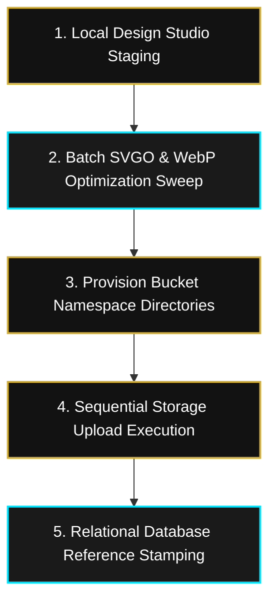

# AMD MUSIC INTELLIGENCE — PHASE 2D DEPLOYMENT SPECIFICATION
## PRODUCTION ASSET DEPLOYMENT & CLOUD STORAGE MAPPING
> **Canonical Cloud Infrastructure Upload Sequence & DevOps Provisioning Guide**  
> **Master Platform:** AMD Music Intelligence Ecosystem (Supabase Storage Architecture)  
> **Target Instance:** Supabase Storage Cluster (`Client-Portal-007` | `https://pjoijeligrgttimkqftk.supabase.co`)  
> **Campaign Focus:** Friday Launch Campaign (*Chrome Music Hub | VaB | Chrome AfroFusion Radio*)  
> **Document Version:** 1.0.0 | **Status:** **LOCKED FOR DEVOPS UPLOAD EXECUTION**  
> **Date:** 2026-06-25 | **Authority:** Product Delivery Architect, AMD Solutions 007  

---

## EXECUTIVE PREAMBLE

Following the successful completion and production locking of the Phase 1 Database Foundation, Phase 2A Smart Link Specifications, Phase 2B Asset Manifests, and Phase 2C Campaign Configurations, **Phase 2D** defines the **definitive production asset deployment plan**. 

This specification dictates the exact operational sequence that **AMD Solutions 007** DevOps engineers and label administrators must follow when uploading physical media into Supabase Storage buckets (`mi-covers`, `mi-hub-assets`, `mi-audio`). It enforces strict upload ordering, folder topologies, canonical CDN URL structures, relational database field bindings, rollback versioning strategies, and Friday launch verification gates to ensure zero broken image links or CDN cache misses when ad network campaigns are activated.

---

## TABLE OF CONTENTS
1. [Section 1: Production Asset Deployment Strategy](#1-production-asset-deployment-strategy)
2. [Section 2: Complete Asset Upload Order (Phases A–D)](#2-complete-asset-upload-order)
3. [Section 3: Storage Bucket Mapping & Boundary Rationale](#3-storage-bucket-mapping)
4. [Section 4: Production File Naming Convention & Hierarchy](#4-production-file-naming-convention)
5. [Section 5: Expected Canonical Public CDN URLs](#5-expected-public-urls)
6. [Section 6: Relational Database Field Mapping](#6-database-mapping)
7. [Section 7: Step-by-Step Upload Verification Checklist](#7-upload-verification-checklist)
8. [Section 8: Rollback & Immutable Versioning Strategy](#8-rollback--versioning-strategy)
9. [Section 9: Friday Launch Readiness Pre-Spend Gate](#9-friday-launch-readiness-checklist)

---

## 1. PRODUCTION ASSET DEPLOYMENT STRATEGY

The deployment strategy transitions unmanaged local media studio files into high-availability cloud storage assets through a systematic 5-stage pipeline:



1. **Local Staging Audit:** All uncompressed source artwork (`.tiff, .psd, .ai`) must be audited in local staging to verify alpha channel boundaries and aspect ratios.
2. **Batch Sanitize & Convert:** Execute automated sweeps converting raster covers into lossy WebP (`q=85`) and stripping vector icons of embedded bitmaps via SVGO.
3. **Provision Namespaces:** Establish isolated tenant folder structures (`/chrome/covers/`, `/shared/brand/`) before pushing files.
4. **Sequential Upload:** Push foundational shared vectors first, tenant wordmarks second, campaign raster artwork third, and private acoustic masters last.
5. **Database Binding:** Stamp the resulting public Supabase CDN URLs into underlying base tables (`mi_client_hubs`, `mi_playlists`, `mi_smart_links`) atomically.

---

## 2. COMPLETE ASSET UPLOAD ORDER

To prevent DOM hydration errors and ensure shared dependency readiness during deployment, files must be uploaded in this exact **16-step chronological sequence**:

### Phase A: Foundational Ecosystem Vectors (`mi-hub-assets`)
* **Step 1:** Upload master ecosystem crest -> `amd-music-intelligence-logo.svg`
* **Step 2:** Upload metallic authentication badge -> `gold-verified-badge.svg`
* **Step 3:** Upload DSP streaming vector pack -> `[spotify, apple-music, audiomack, boomplay, youtube-music, youtube, soundcloud, deezer, amazon-music].svg`

### Phase B: B2B Tenant Brand Wordmarks (`mi-hub-assets`)
* **Step 4:** Upload record label primary logo -> `chrome-music-hub-logo.svg`

### Phase C: Promotional Campaign Raster Artwork (`mi-covers`)
* **Step 5:** Upload landing page background blur -> `dark-glass-background-artwork.webp`
* **Step 6:** Upload editorial release artwork -> `chrome-afrofusion-radio-playlist-cover.webp`
* **Step 7:** Upload social graph OG preview card -> `smart-link-hero-artwork.webp`
* **Step 8:** Upload performer editorial cutout -> `vab-transparent-hero-png.webp`

### Phase D: Encrypted Acoustic Master Streams (`mi-audio`)
* **Step 9:** Upload normalized audio preview snippet -> `vab-afrofusion-audio-preview-30s.mp3`

---

## 3. STORAGE BUCKET MAPPING

| Supabase Storage Bucket | Assigned Production Assets | Bucket Visibility | Cache-Control Header | Engineering Rationale |
| :--- | :--- | :---: | :--- | :--- |
| **`mi-covers`** | Playlist covers, Hero artwork, VaB transparent PNG, Background artwork. | **PUBLIC** | `max-age=31536000, immutable` | High-bandwidth raster photography requiring public global CDN caching and automated edge transforms (`width=600`). |
| **`mi-hub-assets`** | AMD Music Intelligence logo, Chrome Music Hub logo, Gold verified badge, 9 DSP SVG icons. | **PUBLIC** | `max-age=31536000, immutable` | Resolution-independent vector graphics (`.svg`). Segregating UI UI marks from raster imagery prevents DOM layout shifts. |
| **`mi-audio`** | 30-Second audio preview assets. | **PRIVATE** | `no-cache, no-store` | Private audio boundary blocking direct HTTP GET access. Enforces short-lived signed URL token generation on backend API proxies. |

---

## 4. PRODUCTION FILE NAMING CONVENTION

All uploaded media must strictly adhere to lowercase kebab-case grammar mapped across declarative folder hierarchies:

```
storageCluster (Client-Portal-007)
 ├── mi-covers
 │    └── chrome
 │         ├── covers
 │         │    ├── chrome-afrofusion-radio-playlist-cover.webp
 │         │    └── vab-transparent-hero-png.webp
 │         └── campaigns
 │              ├── smart-link-hero-artwork.webp
 │              └── dark-glass-background-artwork.webp
 │
 ├── mi-hub-assets
 │    ├── chrome
 │    │    └── brand
 │    │         └── chrome-music-hub-logo.svg
 │    └── shared
 │         ├── brand
 │         │    └── amd-music-intelligence-logo.svg
 │         ├── badges
 │         │    └── gold-verified-badge.svg
 │         └── dsp-icons
 │              ├── spotify.svg
 │              ├── apple-music.svg
 │              ├── audiomack.svg
 │              ├── boomplay.svg
 │              ├── youtube-music.svg
 │              ├── youtube.svg
 │              ├── soundcloud.svg
 │              ├── deezer.svg
 │              └── amazon-music.svg
 │
 └── mi-audio
      └── chrome
           └── audio
                └── vab-afrofusion-audio-preview-30s.mp3
```

---

## 5. EXPECTED PUBLIC URLS

Upon upload completion, the Supabase Storage CDN cluster (`https://pjoijeligrgttimkqftk.supabase.co`) will expose the following canonical public URLs:

### 5.1 Public Raster CDN (`mi-covers`)
* `https://pjoijeligrgttimkqftk.supabase.co/storage/v1/object/public/mi-covers/chrome/covers/chrome-afrofusion-radio-playlist-cover.webp`
* `https://pjoijeligrgttimkqftk.supabase.co/storage/v1/object/public/mi-covers/chrome/covers/vab-transparent-hero-png.webp`
* `https://pjoijeligrgttimkqftk.supabase.co/storage/v1/object/public/mi-covers/chrome/campaigns/smart-link-hero-artwork.webp`
* `https://pjoijeligrgttimkqftk.supabase.co/storage/v1/object/public/mi-covers/chrome/campaigns/dark-glass-background-artwork.webp`

### 5.2 Public Vector CDN (`mi-hub-assets`)
* `https://pjoijeligrgttimkqftk.supabase.co/storage/v1/object/public/mi-hub-assets/shared/brand/amd-music-intelligence-logo.svg`
* `https://pjoijeligrgttimkqftk.supabase.co/storage/v1/object/public/mi-hub-assets/chrome/brand/chrome-music-hub-logo.svg`
* `https://pjoijeligrgttimkqftk.supabase.co/storage/v1/object/public/mi-hub-assets/shared/badges/gold-verified-badge.svg`
* `https://pjoijeligrgttimkqftk.supabase.co/storage/v1/object/public/mi-hub-assets/shared/dsp-icons/spotify.svg`
* `https://pjoijeligrgttimkqftk.supabase.co/storage/v1/object/public/mi-hub-assets/shared/dsp-icons/apple-music.svg`

### 5.3 Private Signed Proxy Protocol (`mi-audio`)
* *Private Origin:* `https://pjoijeligrgttimkqftk.supabase.co/storage/v1/object/mi-audio/chrome/audio/vab-afrofusion-audio-preview-30s.mp3` *(Returns HTTP 400/403 directly)*.
* *Temporary Signed URI:* `https://pjoijeligrgttimkqftk.supabase.co/storage/v1/object/sign/mi-audio/chrome/audio/vab-afrofusion-audio-preview-30s.mp3?token=eyJhY2Nlc3NfdG9rZW4...` *(Returns HTTP 206 Partial Content)*.

---

## 6. DATABASE MAPPING

Once production URLs are verified, label administrators must execute SQL mutations stamping exact asset paths into underlying Phase 1 base tables:

| Physical Uploaded Asset | Relational Target Table | Target Database Column | Stamped Column Value |
| :--- | :--- | :--- | :--- |
| `chrome-music-hub-logo.svg` | `mi_client_hubs` | `custom_logo_url` | `.../mi-hub-assets/chrome/brand/chrome-music-hub-logo.svg` |
| `chrome-afrofusion-radio-playlist-cover.webp` | `mi_playlists` | `custom_cover_url` | `.../mi-covers/chrome/covers/chrome-afrofusion-radio-playlist-cover.webp` |
| `smart-link-hero-artwork.webp` | `mi_smart_links` | `og_image_url` | `.../mi-covers/chrome/campaigns/smart-link-hero-artwork.webp` |
| `vab-transparent-hero-png.webp` | `mi_artists` | `profile_image_url` | `.../mi-covers/chrome/covers/vab-transparent-hero-png.webp` |

---

## 7. UPLOAD VERIFICATION CHECKLIST

DevOps engineers must execute this 6-step inspection sequence after every individual storage push:

- [ ] **Step 1 (HTTP Handshake):** Execute `curl -I <PUBLIC_CDN_URL>`; confirm HTTP 200 OK status code.
- [ ] **Step 2 (MIME Type Check):** Verify `Content-Type` header returns exact MIME match (`image/webp` or `image/svg+xml`).
- [ ] **Step 3 (Cache Lock Verification):** Verify `Cache-Control` header returns `max-age=31536000, immutable`.
- [ ] **Step 4 (Alpha Channel Audit):** Inspect `vab-transparent-hero-png.webp` in browser; confirm clean RGBA cutout over charcoal background.
- [ ] **Step 5 (Vector Scalability):** Zoom browser viewport to 300% on `gold-verified-badge.svg`; confirm zero raster pixelation.
- [ ] **Step 6 (Database Sync Check):** Query target table column; confirm string exactly matches active CDN URL.

---

## 8. ROLLBACK & VERSIONING STRATEGY

**CRITICAL DEVOPS AXIOM: NEVER OVERWRITE AN EXISTING ASSET FILE IN PLACE.**

If Chrome Entertainment delivers updated release artwork for Week 2, overwriting `chrome-afrofusion-radio-playlist-cover.webp` causes global ad networks, fan mobile browsers, and WhatsApp status servers to serve broken or stale cached graphics due to immutable CDN headers.

### 8.1 Zero-Downtime Artwork Revision Protocol
1. **Upload New Revision:** Append an incremented revision tag to the filename: `chrome-afrofusion-radio-playlist-cover-v2.webp`.
2. **Push to Storage:** Upload the new file to `mi-covers/chrome/covers/`.
3. **Atomic Database Mutation:** Execute `UPDATE mi_playlists SET custom_cover_url = '.../cover-v2.webp' WHERE slug = 'chrome-afrofusion-radio';`.
4. **Instant Edge Propagation:** Next.js landing pages automatically read the fresh URL on next request. Old Smart Links shared in WhatsApp groups remain intact and functional.

---

## 9. FRIDAY LAUNCH READINESS CHECKLIST

Before authorizing campaign spend on Meta Ads and Google Ads, confirm all 10 deployment gates:

- [ ] **Gate 1:** Storage buckets (`mi-covers`, `mi-hub-assets`, `mi-audio`) active on `Client-Portal-007`.
- [ ] **Gate 2:** Master ecosystem crest (`amd-music-intelligence-logo.svg`) uploaded & verified 200 OK.
- [ ] **Gate 3:** Gold verified badge (`gold-verified-badge.svg`) uploaded & verified 200 OK.
- [ ] **Gate 4:** All 9 DSP vector SVG icons uploaded & verified 200 OK.
- [ ] **Gate 5:** Chrome Music Hub wordmark uploaded & bound to `mi_client_hubs.custom_logo_url`.
- [ ] **Gate 6:** Master release cover art uploaded & bound to `mi_playlists.custom_cover_url`.
- [ ] **Gate 7:** Social OG preview card uploaded & bound to `mi_smart_links.og_image_url`.
- [ ] **Gate 8:** VaB transparent character cutout uploaded & bound to `mi_artists.profile_image_url`.
- [ ] **Gate 9:** Private 30s preview audio uploaded to `mi-audio` & signed URL generation tested.
- [ ] **Gate 10:** Solutions 007 Delivery Architect formally signs off on deployment manifest.

***
*Specification locked for production asset deployment execution.*  
**— Product Delivery Architect, AMD Solutions 007**  
**2026-06-25**
