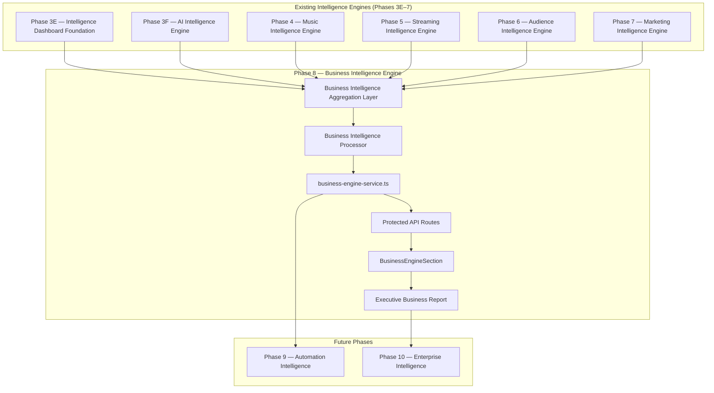

# AMD Music Intelligence — Phase 8 Executive Architecture Blueprint

> **Classification:** Executive Architecture Planning  
> **Track:** H — Business Intelligence Engine  
> **Version:** 1.0.0  
> **Status:** 🟢 Executive Planning Phase  
> **Owner:** AMD Solutions 007  
> **Effective Date:** 2026-07-13  
> **Authority:** Subordinate to [AMC](./architecture/AMD_MUSIC_INTEL_AMC.md) · Implements [MES](./AMD_MUSIC_INTEL_MASTER_EXECUTION_STATUS.md) Track H roadmap

---

## Table of Contents

1. [Executive Vision](#1-executive-vision)
2. [Executive Objective](#2-executive-objective)
3. [Architecture Position](#3-architecture-position)
4. [Orchestration Model](#4-orchestration-model)
5. [Service Layer Specification](#5-service-layer-specification)
6. [Executive Business Modules](#6-executive-business-modules)
7. [Data Foundation](#7-data-foundation)
8. [Revenue Strategy](#8-revenue-strategy)
9. [Connector Framework](#9-connector-framework)
10. [API & RBAC](#10-api--rbac)
11. [User Experience](#11-user-experience)
12. [Executive Dashboard Widgets](#12-executive-dashboard-widgets)
13. [Enterprise Principles](#13-enterprise-principles)
14. [Phase 9 Preparation](#14-phase-9-preparation)
15. [Implementation File Map](#15-implementation-file-map)
16. [Success Criteria](#16-success-criteria)
17. [Executive Recommendation](#17-executive-recommendation)

---

## 1. Executive Vision

Phase 8 establishes the **Business Intelligence Engine** — the highest operational intelligence layer before Automation Intelligence (Phase 9).

This phase does **not** introduce another isolated intelligence module. It becomes the **Executive Command Center** that unifies every intelligence layer built from Phases 3E through 7.

**Purpose:** Transform operational intelligence into executive business decision intelligence.

**Strategic outcome:** AMD Music Intelligence evolves from a music platform into an **Executive Decision Intelligence Platform** — a single source of truth for CEOs, labels, distributors, publishers, managers, and enterprise partners.

---

## 2. Executive Objective

An executive opens one dashboard and immediately understands:

| Domain | Executive Question |
|---|---|
| Overall business health | Is the platform operating successfully? |
| Platform growth | Is adoption accelerating? |
| Artist growth | Is the roster expanding? |
| Partner growth | Is the partner network scaling? |
| Marketing performance | Are campaigns driving results? |
| Audience growth | Is the listener base expanding? |
| Streaming performance | Are DSP destinations performing? |
| Music submission performance | Is the submission pipeline healthy? |
| Platform adoption | Are users activating intelligence features? |
| Executive KPIs | What are the top-line numbers right now? |

**Without opening multiple dashboards.**

---

## 3. Architecture Position



**Key architectural distinction:** Phases 4–7 collect from raw production data. Phase 8 **orchestrates** by calling existing engine services — it does not duplicate collector logic or re-query the same tables independently.

---

## 4. Orchestration Model

### 4.1 Aggregation Layer

The Business Intelligence collector invokes existing service loaders in parallel:

| Upstream Engine | Service Function (Artist) | Service Function (Partner) |
|---|---|---|
| Phase 3E | `loadArtistIntelligence()` | `loadPartnerIntelligence()` |
| Phase 3F | `loadArtistAiIntelligence()` | `loadPartnerAiIntelligence()` |
| Phase 4 | `loadArtistMusicEngine()` | `loadPartnerMusicEngine()` |
| Phase 5 | `loadArtistStreamingEngine()` | `loadPartnerStreamingEngine()` |
| Phase 6 | `loadArtistAudienceEngine()` | `loadPartnerAudienceEngine()` |
| Phase 7 | `loadArtistMarketingEngine()` | `loadPartnerMarketingEngine()` |

**Source files:**
- `intelligence-service.ts` (3E)
- `ai-intelligence-service.ts` (3F)
- `music-engine-service.ts` (4)
- `streaming-engine-service.ts` (5)
- `audience-engine-service.ts` (6)
- `marketing-engine-service.ts` (7)

### 4.2 Processor Responsibilities

The Business Intelligence processor:

1. Normalizes upstream payloads into executive KPI structures
2. Computes cross-engine composite scores (deterministic — no LLM fabrication)
3. Generates executive alerts from threshold rules on aggregated data
4. Builds unified executive scorecards from per-engine health dashboards
5. Produces chronological business timeline from per-engine timeline events
6. Assembles the Executive Business Report

### 4.3 No Duplication Rule

| Forbidden | Required |
|---|---|
| Re-querying `mi_click_tracking` independently | Read from streaming/audience/marketing engine payloads |
| Re-analyzing submissions independently | Read from music/AI engine payloads |
| Recomputing dashboard metrics independently | Read from intelligence dashboard payloads |
| Hard-coded business rules | Derive from upstream engine outputs |

---

## 5. Service Layer Specification

Follows established Phase 4–7 naming convention with domain slug `business`:

| Layer | File |
|---|---|
| Types | `business-engine-types.ts` |
| Constants | `business-engine-constants.ts` |
| Connectors | `business-engine-connectors.ts` |
| Collector | `business-engine-collector.ts` |
| Processor | `business-engine-processor.ts` |
| Service | `business-engine-service.ts` |

**Location:** `apps/website/src/lib/music-intelligence/`

**Service exports:**
- `loadArtistBusinessEngine(session)` → `BusinessEnginePayload`
- `loadPartnerBusinessEngine(session)` → `BusinessEnginePayload`
- `emptyPayload(scope)` — honest fallback when upstream engines return no live data

**Payload structure (top-level):**

```typescript
interface BusinessEnginePayload {
  scope: 'artist' | 'partner';
  generatedAt: string;
  dataSource: 'live' | 'fallback';
  executiveKpis: ExecutiveKpiDashboard;
  businessHealth: BusinessHealthIntelligence;
  growth: GrowthIntelligence;
  revenue: RevenueIntelligenceFramework;
  performance: ExecutivePerformanceIntelligence;
  crossEngine: CrossEngineIntelligence;
  alerts: ExecutiveAlert[];
  scorecards: ExecutiveScorecards;
  timeline: BusinessTimelineEvent[];
  executiveReport: ExecutiveBusinessReport;
  healthDashboard: BusinessHealthDashboard;
}
```

---

## 6. Executive Business Modules

### 6.1 Executive KPI Dashboard

| KPI | Source Engine |
|---|---|
| Total Artists | Phase 3E intelligence dashboard (partner scope) |
| Total Partners | Phase 3E intelligence dashboard |
| Total Organizations | Phase 3D partner context |
| Total Music Submissions | Phase 3E / Phase 4 music engine |
| Active Campaigns | Phase 7 marketing engine |
| Streaming Activity | Phase 5 streaming engine |
| Audience Growth | Phase 6 audience engine |
| Marketing Performance | Phase 7 marketing engine |
| Platform Health | Composite from all engine health dashboards |
| Executive Score | Deterministic composite score |

### 6.2 Business Health Intelligence

| Metric | Derivation |
|---|---|
| Overall Business Health | Weighted composite of engine health scores |
| Growth Score | From Growth Intelligence module |
| Operational Health | Submission pipeline + platform stability |
| Platform Stability | Engine availability + data coverage |
| Intelligence Coverage | Count of engines with `hasLiveData: true` |
| Executive Readiness | AI readiness + submission readiness composite |

### 6.3 Growth Intelligence

| Period | Method |
|---|---|
| Daily / Weekly / Monthly / Quarterly / Yearly | Deterministic trend from upstream engine timestamps and counts |
| Growth Trends | Period-over-period delta from intelligence dashboard metrics |

Honest empty states when insufficient historical data exists.

### 6.4 Revenue Intelligence Framework

**Framework only — no fabricated financial values.**

| Revenue Domain | Status at Phase 8 |
|---|---|
| Revenue | Empty state — `hasLiveData: false` |
| Royalties | Connector stub |
| Subscription Revenue | Connector stub |
| Partner Revenue | Connector stub |
| Future Financial APIs | Connector framework ready |

Connectors follow `business-engine-connectors.ts` pattern with `status: 'awaiting_integration'`.

### 6.5 Executive Performance Intelligence

Aggregates performance summaries from:

| Domain | Upstream |
|---|---|
| Artist Performance | Phase 4 music engine + Phase 3F AI engine |
| Partner Performance | Phase 3E partner intelligence |
| Campaign Performance | Phase 7 marketing engine |
| Audience Performance | Phase 6 audience engine |
| Streaming Performance | Phase 5 streaming engine |
| Platform Performance | Phase 3E intelligence dashboard |

### 6.6 Cross-Engine Intelligence

Produces one unified executive summary by merging:

- `executiveReport` from Phases 4–7
- `executiveInsights` from Phase 3F
- Dashboard summary from Phase 3E

Output: `CrossEngineIntelligence` with `unifiedSummary`, `engineStatuses[]`, `topRecommendations[]`.

### 6.7 Executive Alerts

Deterministic alert generation from threshold rules:

| Alert Type | Trigger |
|---|---|
| Rapid Growth | Period-over-period growth exceeds threshold |
| Declining Performance | Engine health score drops below threshold |
| Missing Data | Engine returns `hasLiveData: false` |
| Platform Health Issues | Composite health below threshold |
| Campaign Opportunities | Marketing engine identifies unattributed traffic |
| Intelligence Gaps | Engine coverage below 100% |

No `Math.random`. No fabricated alerts.

### 6.8 Executive Scorecards

| Scorecard | Source |
|---|---|
| Platform | Composite health dashboard |
| Artists | Music engine portfolio summary |
| Partners | Partner intelligence metrics |
| Campaigns | Marketing engine campaign health |
| Audience | Audience engine health dashboard |
| Streaming | Streaming engine health dashboard |
| Marketing | Marketing engine health dashboard |

### 6.9 Business Timeline

Chronological merge of timeline events from all upstream engines, sorted by timestamp:

- Platform milestones (3E)
- Artist growth events (4)
- Partner growth events (3D context)
- Campaign milestones (7)
- Audience growth (6)
- Streaming growth (5)
- Intelligence milestones (3F)

### 6.10 Executive Business Report

Deterministic report sections:

| Section | Content |
|---|---|
| Business Status | Top-line KPI summary |
| Operational Health | Engine availability + data coverage |
| Executive KPIs | KPI dashboard snapshot |
| Intelligence Summary | Cross-engine unified summary |
| Business Risks | Derived from alerts + declining metrics |
| Growth Opportunities | Derived from growth intelligence + gaps |
| Executive Recommendations | Merged from all upstream `recommendations[]` |

---

## 7. Data Foundation

### 7.1 Reuse Rule

Business Intelligence reuses **all** existing production engines. No new SQL migrations required at Phase 8.

### 7.2 Orchestration Data Flow

```
Session (artist/partner)
  → business-engine-collector.ts
    → Promise.all([
        loadArtistIntelligence(),
        loadArtistAiIntelligence(),
        loadArtistMusicEngine(),
        loadArtistStreamingEngine(),
        loadArtistAudienceEngine(),
        loadArtistMarketingEngine(),
      ])
  → business-engine-processor.ts
    → normalize · score · alert · report
  → BusinessEnginePayload
```

### 7.3 Supplementary Context (Non-Duplicative)

The collector may additionally load lightweight context not available in engine payloads:

| Context | Source | Purpose |
|---|---|---|
| Partner organization profile | `partner-service.ts` | Organization count KPI |
| Workspace dashboard | `workspace-service.ts` | Operational notifications count |

These are **context supplements only** — not intelligence re-computation.

---

## 8. Revenue Strategy

Phase 8 prepares the platform for future commercial capabilities without fabricating financial data.

### 8.1 Connector Stubs

| Connector | Purpose | Phase 8 Status |
|---|---|---|
| `royalties-connector` | Future royalty API integration | Stub |
| `payments-connector` | Future payment gateway | Stub |
| `billing-connector` | Future billing system | Stub |
| `subscriptions-connector` | Future subscription management | Stub |
| `enterprise-plans-connector` | Future enterprise billing | Stub |
| `marketplace-connector` | Future marketplace revenue | Stub |
| `licensing-connector` | Future licensing revenue | Stub |

### 8.2 Empty State Contract

All revenue metrics return:

```typescript
{ value: null, hasLiveData: false, summary: 'Awaiting financial API integration.' }
```

---

## 9. Connector Framework

Continues established architecture — no redesign:

```
Collector → Processor → Service → Protected API → Dashboard → Executive Report
```

**Phase 8 connectors** are primarily **financial API stubs** for future phases. Operational intelligence connectors are not needed because Phase 8 orchestrates existing engines.

---

## 10. API & RBAC

### 10.1 API Routes

| Scope | Path |
|---|---|
| Artist (workspace) | `/api/music-intelligence/workspace/business-engine` |
| Partner | `/api/music-intelligence/partner/business-engine` |

**Route files:**
- `apps/website/src/app/api/music-intelligence/workspace/business-engine/route.ts`
- `apps/website/src/app/api/music-intelligence/partner/business-engine/route.ts`

### 10.2 Authentication

| Scope | Guard |
|---|---|
| Workspace | `requireArtistWorkspaceSession()` |
| Partner | `requirePartnerWorkspaceSession()` |

**Expected unauthenticated response:** HTTP 401 `{"error":"Authentication required."}`

### 10.3 Expected Route Count

Post-Phase 8 production build: **60 routes** (58 current + 2 new API routes).

---

## 11. User Experience

### 11.1 Extension Rule

Extend existing dashboards. **Do not redesign:**

- Artist Dashboard
- Partner Dashboard
- Analytics Foundation Panel
- Any Phase 3E–7 intelligence section

### 11.2 UI Components

| Component | Path |
|---|---|
| `BusinessEngineSection.tsx` | Top-level section — fetches API, renders executive modules |
| `BusinessEngineModule.tsx` | Styled card wrapper |
| `ExecutiveKpiPanel.tsx` | KPI grid |
| `BusinessHealthPanel.tsx` | Health intelligence display |
| `GrowthIntelligencePanel.tsx` | Growth trends |
| `RevenueFrameworkPanel.tsx` | Revenue empty-state framework |
| `CrossEngineSummaryPanel.tsx` | Unified executive summary |
| `ExecutiveAlertsPanel.tsx` | Alert list |
| `ExecutiveScorecardsPanel.tsx` | Scorecard grid |
| `BusinessTimelinePanel.tsx` | Chronological events |

**Location:** `apps/website/src/components/music-intelligence/business-engine/`

### 11.3 Dashboard Integration

Add `BusinessEngineSection` **after** `MarketingEngineSection` in:

| Panel | File |
|---|---|
| Artist Dashboard | `ArtistDashboardPanel.tsx` |
| Partner Dashboard | `PartnerDashboardPanel.tsx` |
| Analytics Foundation | `AnalyticsFoundationPanel.tsx` |

**Stack order (final):**
1. IntelligenceDashboardSection (3E)
2. AIIntelligenceSection (3F)
3. MusicEngineSection (4)
4. StreamingEngineSection (5)
5. AudienceEngineSection (6)
6. MarketingEngineSection (7)
7. **BusinessEngineSection (8)** ← new

---

## 12. Executive Dashboard Widgets

| Widget | Derivation |
|---|---|
| Executive Health Score | Composite of all engine health scores |
| Business Growth Score | Growth Intelligence module |
| Revenue Readiness | Revenue connector coverage percentage |
| Artist Growth | Music engine + intelligence dashboard |
| Partner Growth | Partner intelligence metrics |
| Submission Health | Music engine portfolio health |
| Marketing Health | Marketing engine health dashboard |
| Audience Health | Audience engine health dashboard |
| Streaming Health | Streaming engine health dashboard |
| Platform Health | Intelligence dashboard stability |
| Overall Executive Score | Weighted composite |

---

## 13. Enterprise Principles

Every Business Intelligence component must be:

| Principle | Enforcement |
|---|---|
| Modular | One module per executive domain |
| Deterministic | No LLM fabrication · no `Math.random` |
| API-driven | All data via protected API routes |
| Enterprise-ready | RBAC · session guards · honest empty states |
| Production-ready | Builds on live engine outputs |
| Scalable | Orchestration layer — engines scale independently |
| Future-proof | Revenue connectors · Phase 9 automation hooks |
| Reusable | Payload types consumed by Phase 9 Automation Intelligence |

**Never hard-code business rules.** Always aggregate from existing engines.

---

## 14. Phase 9 Preparation

Everything built in Phase 8 must become reusable for **Phase 9 — Automation Intelligence**, where AI agents take actions based on Business Intelligence rather than only displaying analytics.

### 14.1 Automation Hooks

| Hook | Purpose |
|---|---|
| `executiveReport.recommendations[]` | Action candidates for automation agents |
| `alerts[]` | Trigger conditions for automated responses |
| `scorecards` | Threshold inputs for automated decisions |
| `crossEngine.unifiedSummary` | Context for agent reasoning |
| `revenue.connectors[]` | Future financial automation endpoints |

### 14.2 Future Phase Roadmap

| Phase | Name | Dependency |
|---|---|---|
| Phase 9 | Automation Intelligence | Phase 8 Business Intelligence |
| Phase 10 | Enterprise Intelligence | Phase 9 |
| Phase 11 | Global Intelligence Network | Phase 10 |
| Phase 12 | AMD Music OS™ | Phase 11 |

---

## 15. Implementation File Map

### 15.1 New Files (Phase 8)

```
apps/website/src/lib/music-intelligence/
  business-engine-types.ts
  business-engine-constants.ts
  business-engine-connectors.ts
  business-engine-collector.ts
  business-engine-processor.ts
  business-engine-service.ts

apps/website/src/app/api/music-intelligence/
  workspace/business-engine/route.ts
  partner/business-engine/route.ts

apps/website/src/components/music-intelligence/business-engine/
  BusinessEngineSection.tsx
  BusinessEngineModule.tsx
  ExecutiveKpiPanel.tsx
  BusinessHealthPanel.tsx
  GrowthIntelligencePanel.tsx
  RevenueFrameworkPanel.tsx
  CrossEngineSummaryPanel.tsx
  ExecutiveAlertsPanel.tsx
  ExecutiveScorecardsPanel.tsx
  BusinessTimelinePanel.tsx

apps/website/scripts/
  phase-8-local-verification.mjs
```

### 15.2 Modified Files (Integration Only)

```
apps/website/src/components/music-intelligence/workspace/ArtistDashboardPanel.tsx
apps/website/src/components/music-intelligence/partner-workspace/PartnerDashboardPanel.tsx
apps/website/src/components/music-intelligence/partner-workspace/AnalyticsFoundationPanel.tsx
```

### 15.3 Untouched (Preservation Law)

All Phase 3E–7 engine files, API routes, UI components, middleware, and auth flows remain unchanged.

---

## 16. Success Criteria

Phase 8 architecture is successful when it can:

| Criterion | Verification |
|---|---|
| Aggregate every intelligence engine | Collector invokes all 6 upstream services |
| Produce one Executive Business Dashboard | `BusinessEngineSection` renders unified view |
| Display unified executive KPIs | `executiveKpis` payload populated |
| Generate deterministic executive reports | `executiveReport` assembled from upstream data |
| Provide executive scorecards | `scorecards` derived from engine health dashboards |
| Prepare platform for financial intelligence | Revenue connector stubs with honest empty states |
| Prepare platform for Automation Intelligence | Recommendations · alerts · scorecards exposed |
| Preserve every existing architecture | Zero modifications to Phases 3E–7 engine files |
| Require no redesign of previous phases | Extension-only dashboard integration |

---

## 17. Executive Recommendation

Phase 8 is the most strategically important phase in the AMD Music Intelligence roadmap.

Phases 3E through 7 built individual intelligence engines. Phase 8 transforms those independent engines into one **Executive Business Intelligence Platform**.

Upon completion, AMD Music Intelligence will be positioned as an **Executive Decision Intelligence Platform** — not merely a music platform.

**Next approved action:** Executive Development Authorization for Phase 8 implementation.

**Implementation sequence (upon authorization):**
1. Extend architecture (service layer)
2. Local verification
3. Executive Approval
4. Git commit
5. GitHub push
6. Vercel deployment
7. Production verification
8. Documentation synchronization
9. Final Executive Report

---

*Phase 8 Executive Architecture Blueprint v1.0.0 · AMD Solutions 007 · 2026-07-13*

*Build Once. Scale Forever. Work Smartly. Spend Wisely.*
