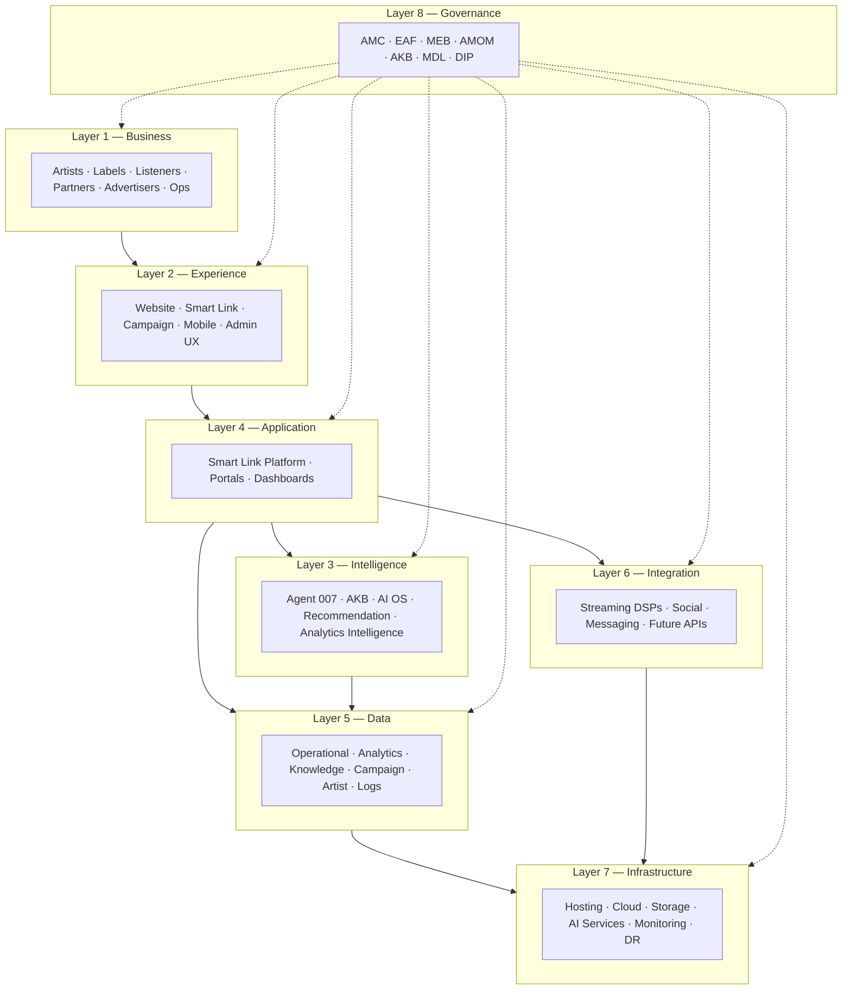
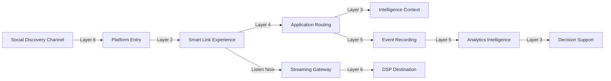
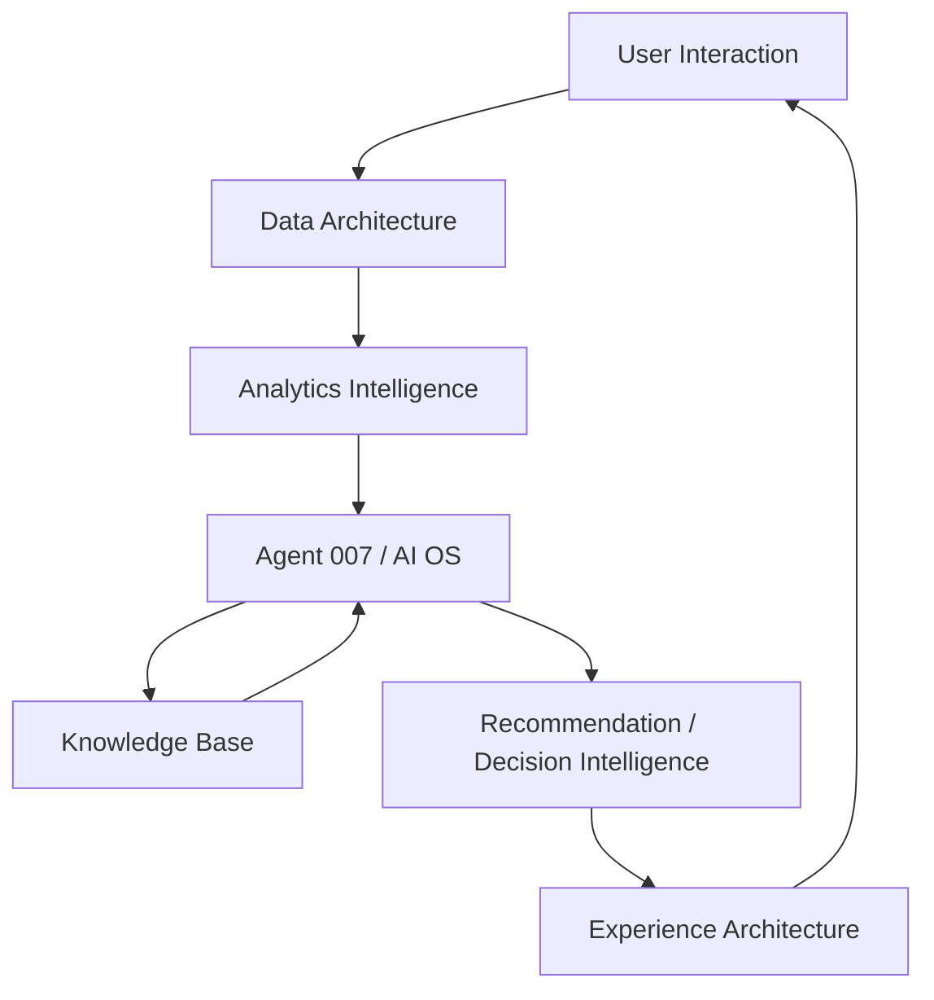

# AMD Music Intelligence — Enterprise Architecture Framework (EAF)

> **Classification:** Enterprise Architecture · Master Structural Reference  
> **Authority:** Subordinate to [AMC](./AMD_MUSIC_INTEL_AMC.md) · Governs all platform organization and evolution  
> **Distinction:** The AMC defines *principles and laws*. The EAF defines *how the platform is organized*.

---

## Table of Contents

1. [Document Information](#1-document-information)
2. [Executive Summary](#2-executive-summary)
3. [Purpose](#3-purpose)
4. [Scope](#4-scope)
5. [Architectural Vision](#5-architectural-vision)
6. [Enterprise Architecture Principles](#6-enterprise-architecture-principles)
7. [Enterprise Architecture Layers](#7-enterprise-architecture-layers)
8. [Platform Relationships](#8-platform-relationships)
9. [Architectural Boundaries](#9-architectural-boundaries)
10. [Scalability Model](#10-scalability-model)
11. [Security & Privacy](#11-security--privacy)
12. [Future Architecture](#12-future-architecture)
13. [References](#13-references)

---

## 1. Document Information

| Field | Value |
|---|---|
| **Title** | AMD Music Intelligence — Enterprise Architecture Framework (EAF) |
| **Version** | 1.0.0 |
| **Status** | Approved Draft |
| **Owner** | AMD Solutions 007 |
| **Approval Authority** | Solutions 007 — Chief Product Architect / Technical Governance |
| **Effective Date** | 2026-07-04 |
| **Last Updated** | 2026-07-04 |

---

## 2. Executive Summary

The Enterprise Architecture Framework (EAF) is the **master architectural reference** for AMD Music Intelligence. It defines how the platform is organized across eight permanent layers — from business stakeholders and user experience through intelligence, applications, data, integration, infrastructure, and governance.

Where the [Architecture Master Charter (AMC)](./AMD_MUSIC_INTEL_AMC.md) establishes constitutional principles and permanent laws, the EAF translates those principles into a **structured enterprise model** that guides platform evolution, capability placement, boundary definition, and scalability planning.

All future platform growth — new artists, campaigns, streaming platforms, AI capabilities, markets, and enterprise customers — must align with the layer model defined herein.

---

## 3. Purpose

The EAF exists to:

- Provide a **single structural reference** for how AMD Music Intelligence is organized
- Define **permanent architecture layers** and their responsibilities
- Clarify **how layers interact** without prescribing implementation
- Establish **architectural boundaries** between business, technology, AI, documentation, operations, and governance
- Describe **how the platform scales** across dimensions of growth
- Reserve **future architecture space** for advanced intelligence and enterprise expansion
- Serve as the authoritative input for the [Master Execution Blueprint (MEB)](../execution/AMD_MUSIC_INTEL_MEB.md) and all downstream documentation

The EAF does **not** define execution sequencing, operational procedures, or technical implementation — those belong in the MEB, AMOM, and domain-specific documents.

---

## 4. Scope

### In Scope

- Enterprise layer definitions and responsibilities
- Logical relationships between layers
- Architectural boundaries and separation of concerns
- Scalability dimensions and growth patterns
- Security and privacy principles at architecture level
- Future architecture reservations
- Governance layer mapping to the Enterprise Documentation Suite

### Out of Scope

- API specifications
- Database schema definitions
- Coding instructions and deployment runbooks
- Campaign-specific configurations
- Temporary project discussions
- Implementation timelines (reserved for MEB)

---

## 5. Architectural Vision

AMD Music Intelligence is architected as a **layered, intelligence-first, multi-tenant enterprise platform** that:

- Separates **business intent** from **technical realization**
- Places **intelligence** at the center of discovery, analytics, and decision support
- Maintains **platform independence** from any single streaming service or social network
- Integrates openly with external ecosystems through defined integration boundaries
- Scales horizontally across tenants, markets, and capability domains
- Governs itself through a documented, hierarchical Enterprise Documentation Suite

The architectural vision aligns with the AMC's identity as an AI-powered Music Intelligence Platform operating within the AMD Solutions 007 ecosystem.

---

## 6. Enterprise Architecture Principles

These principles govern how the eight layers are designed, extended, and governed. They complement the constitutional principles defined in the AMC.

| Principle | Definition |
|---|---|
| **Modular by Design** | Capabilities are organized as distinct modules within layers. Modules may evolve independently within defined boundaries. |
| **Intelligence First** | Intelligence services are first-class architectural citizens — not retrofitted analytics on top of routing. |
| **Analytics Driven** | Platform behavior, product decisions, and improvement cycles are informed by measured, verifiable data. |
| **Platform Independence** | The Master Platform remains sovereign. External services are integrated, not embedded as dependencies of identity. |
| **Open Integration** | External platforms connect through defined integration boundaries with clear responsibility separation. |
| **Secure by Default** | Security and tenant isolation are architectural requirements at every layer — not optional overlays. |
| **AI Assisted** | Artificial intelligence augments human judgment within governed boundaries defined by AI governance. |
| **Enterprise Scalability** | Every layer must support growth from single-tenant pilot to multi-tenant enterprise without structural reinvention. |
| **Business Continuity** | Architecture supports operational resilience, recoverability, and graceful degradation under failure conditions. |

---

## 7. Enterprise Architecture Layers

AMD Music Intelligence is organized into **eight permanent layers**. Layer numbering reflects logical dependency — higher layers consume capabilities from lower layers. Layers are conceptual boundaries, not organizational silos.

---

### Layer 1 — Business Architecture

**Purpose:** Defines *who* the platform serves and *what* business value it delivers.

| Stakeholder | Business Role |
|---|---|
| **Artists** | Create music; require discovery, audience reach, and career intelligence |
| **Labels & Collectives** | Manage rosters; require multi-artist governance, analytics, and distribution intelligence |
| **Listeners** | Discover and consume music; require curated experiences and seamless streaming access |
| **Partners** | Integrate with the platform for co-distribution, data exchange, and market reach |
| **Advertisers** | Reach targeted music audiences through governed campaign channels |
| **Administrators** | Operate Client Hubs, manage tenants, and configure platform capabilities |
| **Internal Operations** | Maintain platform health, governance compliance, and strategic execution |

**Business Architecture Outputs:**
- Client Hub tenant model
- Artist–Label–Listener relationship hierarchy
- Audience ownership as strategic business capital
- Revenue and partnership models (defined in business documents, not herein)

---

### Layer 2 — Experience Architecture

**Purpose:** Defines *how* users interact with the platform across all touchpoints.

| Experience Domain | Description |
|---|---|
| **Corporate Website** | Public-facing brand presence and platform introduction |
| **Smart Link** | Primary acquisition and conversion surface — sovereign entry point to the ecosystem |
| **Campaign Experience** | Time-bound promotional surfaces tied to releases, playlists, and artist launches |
| **Mobile Experience** | Responsive and mobile-native interaction patterns across all surfaces |
| **Future Applications** | Reserved for native apps, progressive web applications, and embedded experiences |
| **Administrative Experience** | Internal and Client Hub operator interfaces for configuration and management |

**Experience Architecture Constraints (from AMC):**
- The motherboard visual identity is the canonical Smart Link layout
- Listen Now is a streaming-only conversion action
- Social discovery and streaming remain visually and functionally distinct

---

### Layer 3 — Intelligence Architecture

**Purpose:** Defines *how the platform thinks* — AI, knowledge, recommendation, and decision support.

| Intelligence Component | Description |
|---|---|
| **Agent 007** | Platform intelligence layer — contextual understanding and AI-assisted operations |
| **Knowledge Base (AKB)** | Machine- and agent-readable constraints, laws, and operational context |
| **AI Operating System** | Governed specification for AI capability domains and behavior boundaries |
| **Recommendation Engine** | Music discovery and similarity intelligence for listeners |
| **Analytics Intelligence** | Pattern recognition and insight generation from telemetry and audience data |
| **Decision Intelligence** | AI-assisted support for business and operational decision-making |
| **Campaign Intelligence** | Performance analysis and optimization intelligence for promotional activity |

**Intelligence Architecture Constraints:**
- Agent 007 operates within AI governance boundaries
- Intelligence augments human judgment; it does not override governance or privacy
- All intelligence outputs must be traceable to source data or defined models

---

### Layer 4 — Application Architecture

**Purpose:** Defines *what software capabilities* the platform exposes to users and operators.

| Application | Description |
|---|---|
| **Smart Link Platform** | Core routing, conversion, and streaming gateway capability |
| **Campaign Manager** | Creation, configuration, and lifecycle management of promotional campaigns |
| **Artist Portal** | Artist-facing intelligence, analytics, and profile management |
| **Label Portal** | Client Hub operator interface for roster, campaign, and audience management |
| **Administration Portal** | Platform-level administration, tenant governance, and system configuration |
| **Analytics Dashboard** | Verifiable metrics visualization for artists, labels, and operators |
| **Future Applications** | Reserved for AI Curator, AI DJ, Artist Intelligence, and enterprise products |

**Application Architecture Constraints:**
- Applications consume intelligence and data layers — they do not embed business logic that belongs in intelligence
- Multi-tenant isolation applies to all application domains
- Application boundaries align with experience architecture touchpoints

---

### Layer 5 — Data Architecture

**Purpose:** Defines *what information* the platform stores, processes, and derives — at architecture level only.

| Data Domain | Description |
|---|---|
| **Operational Data** | Transactional records supporting live platform operations |
| **Analytics Data** | Aggregated telemetry, click events, and behavioral measurements |
| **Knowledge Repository** | Structured platform knowledge for agents and intelligence services |
| **Campaign Data** | Campaign configuration, performance records, and lifecycle state |
| **Artist Data** | Artist profiles, catalog references, and career intelligence inputs |
| **Streaming Data** | DSP destination registries, routing configurations, and platform availability state |
| **Interaction Logs** | Append-only records of user interactions, decisions, and system events |
| **Memory Repository** | Institutional memory — architectural decisions, audit trails, and governance records |

**Data Architecture Constraints:**
- Analytics data must reflect verifiable source events — never fabricated metrics
- Tenant data isolation is mandatory across all domains
- Schema definitions belong in database documents, not in the EAF

---

### Layer 6 — Integration Architecture

**Purpose:** Defines *how the platform connects* to external ecosystems through governed boundaries.

#### Streaming Integrations

| Platform Category | Integration Role |
|---|---|
| **Spotify** | Primary DSP streaming destination |
| **Apple Music** | DSP streaming destination |
| **Audiomack** | DSP streaming destination |
| **Boomplay** | DSP streaming destination |
| **SoundCloud** | DSP streaming destination |
| **YouTube Music** | DSP streaming destination |
| **YouTube** | Video and audio streaming destination |
| **Future Streaming Platforms** | Reserved integration slots for emerging DSPs |

#### Social & Communication Integrations

| Platform Category | Integration Role |
|---|---|
| **TikTok** | Social discovery — audience building and traffic acquisition |
| **Instagram** | Social discovery — audience building and traffic acquisition |
| **Facebook** | Social discovery and community engagement |
| **WhatsApp** | Audience ownership and direct fan communication |
| **Future APIs** | Reserved for partner systems, enterprise integrations, and marketplace connections |

**Integration Architecture Constraints (from AMC):**
- Streaming integrations serve playback routing — not discovery identity
- Social integrations serve audience acquisition — not streaming equivalence
- All integrations pass through governed platform boundaries; no direct bypass of analytics or audience capture

---

### Layer 7 — Infrastructure Architecture

**Purpose:** Defines *where and how* platform capabilities are hosted, deployed, and maintained — at architecture level.

| Infrastructure Domain | Description |
|---|---|
| **Hosting** | Application and edge hosting for user-facing surfaces |
| **Cloud Services** | Managed cloud capabilities supporting platform operations |
| **Database Services** | Relational data store for operational and analytics data |
| **AI Services** | External AI capability providers for intelligence layer functions |
| **Storage** | Media asset storage and content delivery |
| **Monitoring** | Health observation, performance tracking, and alerting |
| **Logging** | Centralized event and audit log management |
| **Deployment** | Continuous integration and delivery pipeline for controlled releases |
| **Scalability** | Horizontal and vertical scaling mechanisms for growth |
| **Disaster Recovery** | Backup, recovery, and business continuity infrastructure |

**Infrastructure Architecture Constraints:**
- Infrastructure choices must not create platform lock-in that violates Platform Independence
- Multi-tenant isolation extends to infrastructure boundaries
- Deployment must support certified release governance

---

### Layer 8 — Governance Architecture

**Purpose:** Defines *how the platform governs itself* through documentation, policy, and operational authority.

| Governance Document | Architectural Responsibility |
|---|---|
| **[AMC](./AMD_MUSIC_INTEL_AMC.md)** | Supreme constitutional authority — principles, laws, and decision authority |
| **[EAF](./AMD_MUSIC_INTEL_EAF.md)** | *This document.* Enterprise layer model and structural reference |
| **[MEB](../execution/AMD_MUSIC_INTEL_MEB.md)** | Master execution sequencing — how capabilities are delivered over time |
| **[AMOM](../execution/AMD_MUSIC_INTEL_AMOM.md)** | Operations memory — deployment continuity and runtime governance |
| **[AKB](../intelligence/AMD_MUSIC_INTEL_AKB.md)** | Agent knowledge — machine-readable constraints for AI systems |
| **[AI Operating System](../intelligence/AMD_MUSIC_INTEL_AI_OPERATING_SYSTEM.md)** | AI capability specification and behavior governance |
| **[Analytics Architecture](../analytics/AMD_MUSIC_INTEL_ANALYTICS_ARCHITECTURE.md)** | Measurement architecture — telemetry, tracking, and intelligence data flow |
| **[MDL](../governance/AMD_MUSIC_INTEL_MDL.md)** | Documentation catalog — status, tier, and edit policy for all documents |
| **[DIP](../governance/AMD_MUSIC_INTEL_DIP.md)** | Integration protocol — rules for safe documentation evolution |

**Governance Architecture Constraints:**
- AMC supersedes all other documents in case of conflict
- Locked production records are immutable — governance operates through additive documentation
- AI governance is a distinct authority domain within this layer

---

## 8. Platform Relationships

### 8.1 Layer Stack Model

The eight layers form a logical stack. Upper layers consume capabilities from lower layers. Governance spans all layers.

### 8.2 User Journey — Logical Flow

Illustrates how layers interact for a listener arriving via social discovery. Not an implementation flowchart.

### 8.3 Intelligence Loop

How intelligence architecture consumes data and informs experience.

### 8.4 Governance Overlay

Governance does not sit below infrastructure — it spans all layers as a cross-cutting authority.

| Interaction | Description |
|---|---|
| **AMC → All Layers** | Constitutional laws constrain design at every layer |
| **EAF → MEB** | Layer model informs execution sequencing |
| **AKB → Intelligence Layer** | Agent-readable constraints feed AI operations |
| **MDL + DIP → All Documents** | Documentation governance maintains catalog integrity |
| **AMOM → Infrastructure + Application** | Operations memory governs deployment continuity |

---

## 9. Architectural Boundaries

Clear separation of concerns prevents capability bleed, governance confusion, and architectural drift.

### 9.1 Business ↔ Technology

| Boundary | Business Side | Technology Side |
|---|---|---|
| **Ownership** | Defines *what* value is delivered and *to whom* | Defines *how* value is technically realized |
| **Decision** | Business priorities and stakeholder needs | Technical feasibility and architectural alignment |
| **Change trigger** | Market, artist, or partnership demand | Capability, scale, or integrity requirement |

Business architecture never prescribes implementation. Technology never redefines business stakeholder relationships without business governance review.

### 9.2 Technology ↔ AI

| Boundary | Technology Side | AI Side |
|---|---|---|
| **Ownership** | Application, data, and infrastructure realization | Intelligence models, knowledge, and decision support |
| **Decision** | Platform capability delivery | AI behavior, model selection, and output governance |
| **Change trigger** | Feature or infrastructure requirement | Intelligence capability or model evolution |

AI capabilities operate within technology layers but are governed independently through AI governance. AI does not bypass data architecture or security boundaries.

### 9.3 AI ↔ Documentation

| Boundary | AI Side | Documentation Side |
|---|---|---|
| **Ownership** | Runtime intelligence behavior | Institutional knowledge and constraints |
| **Decision** | Model and capability activation | Document population, amendment, and cataloging |
| **Change trigger** | Intelligence requirement | Governance or constitutional change |

The AKB bridges this boundary — translating documentation constraints into agent-readable knowledge without replacing governed documents.

### 9.4 Documentation ↔ Operations

| Boundary | Documentation Side | Operations Side |
|---|---|---|
| **Ownership** | What is true, approved, and cataloged | What is running, deployed, and monitored |
| **Decision** | Document status and edit authority | Deployment authorization and runtime procedures |
| **Change trigger** | Architectural or governance change | Operational event or deployment cycle |

Operations reference documentation; operations do not silently override documented architecture.

### 9.5 Operations ↔ Governance

| Boundary | Operations Side | Governance Side |
|---|---|---|
| **Ownership** | Runtime platform health and delivery | Policy, authority, and compliance |
| **Decision** | Deploy, rollback, or scale | Approve, amend, or certify |
| **Change trigger** | Operational requirement | Constitutional, architectural, or policy change |

No operational action that violates AMC architectural laws may proceed without executive governance override.

---

## 10. Scalability Model

AMD Music Intelligence scales across seven dimensions without architectural reinvention. Each dimension extends within defined layer boundaries.

### 10.1 New Artists

| Layer Impact | Scalability Pattern |
|---|---|
| Business | New artist entity within existing or new Client Hub |
| Data | New artist records within tenant-isolated data domain |
| Experience | Artist surfaces generated from platform templates — not custom rebuilds |
| Intelligence | Artist context added to recommendation and analytics models |

### 10.2 New Campaigns

| Layer Impact | Scalability Pattern |
|---|---|
| Business | New promotional cycle under existing Client Hub |
| Application | Campaign Manager creates configured instance |
| Data | New campaign data domain — isolated from other campaigns |
| Experience | Campaign experience rendered from certified experience patterns |

### 10.3 New Streaming Platforms

| Layer Impact | Scalability Pattern |
|---|---|
| Integration | New DSP registered in integration layer |
| Application | Streaming Gateway extended with new destination |
| Data | Streaming data registry updated |
| Experience | Motherboard pill added — visual identity preserved |

### 10.4 New AI Capabilities

| Layer Impact | Scalability Pattern |
|---|---|
| Intelligence | New capability domain within AI Operating System |
| Application | New application module consuming intelligence output |
| Governance | AI governance review before activation |
| Data | New knowledge or model inputs within data architecture |

### 10.5 New Countries / Markets

| Layer Impact | Scalability Pattern |
|---|---|
| Business | Market-specific Client Hub or partner relationships |
| Integration | Region-specific DSP and social platform availability |
| Infrastructure | Edge and hosting expansion for latency and compliance |
| Data | Market-segmented analytics within tenant boundaries |

### 10.6 New Enterprise Customers

| Layer Impact | Scalability Pattern |
|---|---|
| Business | New Client Hub tenant with enterprise service tier |
| Application | Label Portal and Analytics Dashboard provisioned |
| Data | Full tenant isolation with enterprise data governance |
| Governance | Enterprise SLA and governance terms applied |

### 10.7 Future Products

| Layer Impact | Scalability Pattern |
|---|---|
| Experience | New experience domain (e.g., native app) |
| Application | New application module within Layer 4 |
| Intelligence | Product-specific intelligence services |
| Integration | Product-specific external connections |

**Scalability Principle:** Extension, not reinvention. New capacity is added within layer boundaries using certified patterns.

---

## 11. Security & Privacy

Architectural principles only. Implementation details belong in security and operations documents.

### 11.1 Security Principles

| Principle | Architectural Requirement |
|---|---|
| **Tenant Isolation** | Client Hub data, analytics, and audience records are logically and access-isolated at every layer |
| **Least Privilege** | Every actor — human, application, or agent — accesses only what its role requires |
| **Defense in Depth** | Security is enforced at experience, application, data, integration, and infrastructure layers |
| **Immutable Audit** | Security-relevant events are recorded in append-only interaction and governance logs |
| **Governed AI Access** | Agent 007 and AI services access data only within defined AI governance boundaries |
| **Integration Trust Boundaries** | External platforms are untrusted beyond defined integration contracts |

### 11.2 Privacy Principles

| Principle | Architectural Requirement |
|---|---|
| **Purpose Limitation** | Audience data is collected for defined platform purposes — not open-ended exploitation |
| **Consent Respect** | Audience capture flows operate with informed user consent |
| **Data Minimization** | Only necessary data is collected, stored, and processed |
| **Client Data Sovereignty** | Client Hub audience data belongs to the Client Hub under governed access rules |
| **Transparency** | Users can understand what data is collected and why |
| **Right to Governance Review** | Privacy architecture changes require governance approval |

---

## 12. Future Architecture

The following capability domains are **architecturally reserved** — not yet fully realized, but accounted for in the layer model. Population of these domains occurs through governed execution phases defined in the MEB.

### 12.1 Multi-Agent Collaboration

| Layer | Reservation |
|---|---|
| Intelligence | Multiple specialized agents operating under unified AI governance |
| Application | Agent orchestration interfaces for operators and power users |
| Governance | Multi-agent authority model and conflict resolution |

### 12.2 Advanced AI Services

| Layer | Reservation |
|---|---|
| Intelligence | AI Curator, AI DJ, conversational discovery, generative playlist intelligence |
| Data | Expanded knowledge repository and model training data domains |
| Integration | External AI model providers beyond current capabilities |

### 12.3 Predictive Analytics

| Layer | Reservation |
|---|---|
| Intelligence | Forecasting models for campaign performance, audience growth, and market trends |
| Data | Historical analytics data lakes for predictive model inputs |
| Application | Predictive dashboards in Analytics and Artist Intelligence surfaces |

### 12.4 Recommendation Intelligence

| Layer | Reservation |
|---|---|
| Intelligence | Collaborative filtering, tag-based similarity, and cultural context models |
| Data | Listening history, preference graphs, and discovery outcome records |
| Experience | Personalized discovery surfaces for listeners |

### 12.5 Music Intelligence Services

| Layer | Reservation |
|---|---|
| Intelligence | Market analysis, genre intelligence, and catalog intelligence services |
| Application | B2B intelligence products for labels, partners, and enterprises |
| Business | Music intelligence as a standalone commercial offering |

### 12.6 Enterprise Intelligence

| Layer | Reservation |
|---|---|
| Application | Enterprise-grade analytics, multi-Hub reporting, and white-label capabilities |
| Business | Enterprise customer tier with SLA-backed intelligence services |
| Governance | Enterprise governance terms and compliance frameworks |

### 12.7 Future Ecosystem Expansion

| Layer | Reservation |
|---|---|
| Integration | Marketplace APIs, third-party developer platform, and partner SDK |
| Business | Platform-as-ecosystem model with external builders and integrators |
| Infrastructure | Multi-region, multi-cloud, and edge intelligence deployment |

---

## 13. References

Referenced by relative path only. Contents are not reproduced herein.

### Constitutional & Enterprise Suite

| Document | Path |
|---|---|
| Architecture Master Charter | [`./AMD_MUSIC_INTEL_AMC.md`](./AMD_MUSIC_INTEL_AMC.md) |
| Master Execution Blueprint | [`../execution/AMD_MUSIC_INTEL_MEB.md`](../execution/AMD_MUSIC_INTEL_MEB.md) |
| Architecture Memory & Operations Manual | [`../execution/AMD_MUSIC_INTEL_AMOM.md`](../execution/AMD_MUSIC_INTEL_AMOM.md) |
| Agent Knowledge Base | [`../intelligence/AMD_MUSIC_INTEL_AKB.md`](../intelligence/AMD_MUSIC_INTEL_AKB.md) |
| AI Operating System | [`../intelligence/AMD_MUSIC_INTEL_AI_OPERATING_SYSTEM.md`](../intelligence/AMD_MUSIC_INTEL_AI_OPERATING_SYSTEM.md) |
| Analytics Architecture | [`../analytics/AMD_MUSIC_INTEL_ANALYTICS_ARCHITECTURE.md`](../analytics/AMD_MUSIC_INTEL_ANALYTICS_ARCHITECTURE.md) |
| Master Documentation Ledger | [`../governance/AMD_MUSIC_INTEL_MDL.md`](../governance/AMD_MUSIC_INTEL_MDL.md) |
| Documentation Integration Protocol | [`../governance/AMD_MUSIC_INTEL_DIP.md`](../governance/AMD_MUSIC_INTEL_DIP.md) |
| Documentation Entry Point | [`../README.md`](../README.md) |

### Strategic & Legacy Documents

| Document | Path |
|---|---|
| Master Strategic README | [`../AMD_MUSIC_INTEL_MASTER_STRATEGIC_README.md`](../AMD_MUSIC_INTEL_MASTER_STRATEGIC_README.md) |
| Product Blueprint | [`../AMD_MUSIC_INTEL_PRODUCT_BLUEPRINT.md`](../AMD_MUSIC_INTEL_PRODUCT_BLUEPRINT.md) |
| Platform Architecture | [`../AMD_MUSIC_INTEL_PLATFORM_ARCHITECTURE.md`](../AMD_MUSIC_INTEL_PLATFORM_ARCHITECTURE.md) |
| SmartLink System | [`../AMD_MUSIC_INTEL_SMARTLINK_SYSTEM.md`](../AMD_MUSIC_INTEL_SMARTLINK_SYSTEM.md) |
| AI DJ Master Roadmap | [`../AMD_AI_DJ_MASTER_ROADMAP.md`](../AMD_AI_DJ_MASTER_ROADMAP.md) |
| Agent 007 Data Architecture | [`../AMD_AGENT_007_DATA_ARCHITECTURE.md`](../AMD_AGENT_007_DATA_ARCHITECTURE.md) |
| Interaction Memory Log | [`../AMD_MUSIC_INTEL_INTERACTION_MEMORY_LOG.md`](../AMD_MUSIC_INTEL_INTERACTION_MEMORY_LOG.md) |

### Database Documents (Schema Authority — Not Reproduced Here)

| Document | Path |
|---|---|
| Database Master Blueprint | [`../AMD_MUSIC_INTEL_DATABASE_MASTER_BLUEPRINT.md`](../AMD_MUSIC_INTEL_DATABASE_MASTER_BLUEPRINT.md) |
| Database Implementation Plan | [`../AMD_MUSIC_INTEL_DATABASE_IMPLEMENTATION_PLAN.md`](../AMD_MUSIC_INTEL_DATABASE_IMPLEMENTATION_PLAN.md) |
| Supabase Migration Plan | [`../AMD_MUSIC_INTEL_SUPABASE_MIGRATION_PLAN.md`](../AMD_MUSIC_INTEL_SUPABASE_MIGRATION_PLAN.md) |

### Historical Production Records (Immutable)

| Document | Path |
|---|---|
| Phase 1 Completion Report | [`../AMD_MUSIC_INTEL_PHASE1_COMPLETION_REPORT.md`](../AMD_MUSIC_INTEL_PHASE1_COMPLETION_REPORT.md) |
| Phase 2A — SmartLink Spec | [`../AMD_MUSIC_INTEL_PHASE2A_SMARTLINK_SPEC.md`](../AMD_MUSIC_INTEL_PHASE2A_SMARTLINK_SPEC.md) |
| Phase 2H — UAT Report | [`../AMD_MUSIC_INTEL_PHASE2H_UAT_REPORT.md`](../AMD_MUSIC_INTEL_PHASE2H_UAT_REPORT.md) |

---

*AMD Music Intelligence — Enterprise Architecture Framework (EAF)*  
*Version 1.0.0 · Approved Draft · Effective 2026-07-04*  
*Authority: AMD Solutions 007 · Subordinate to AMC v1.0.0*
