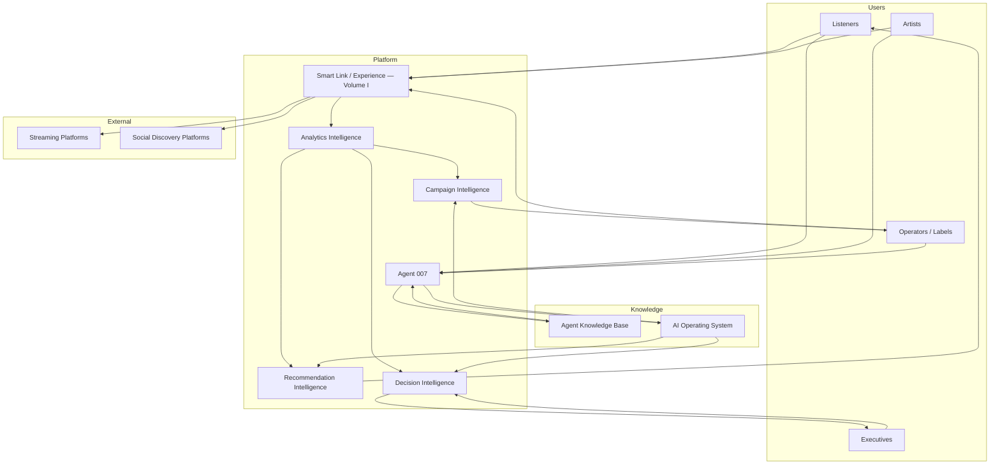
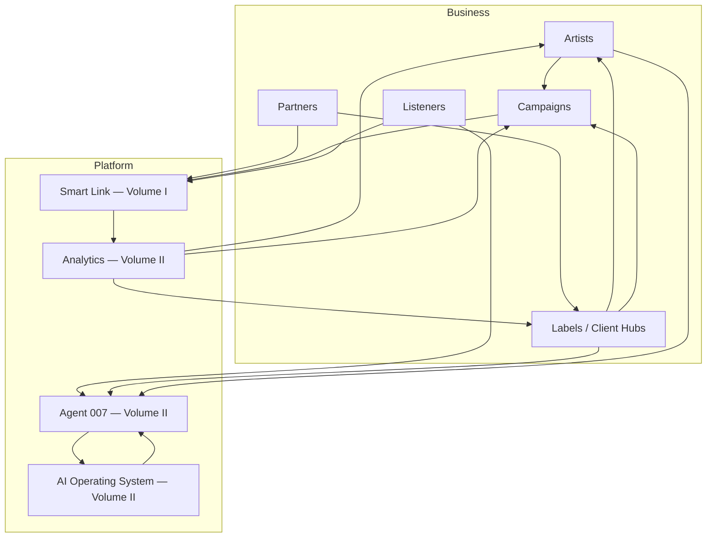

# AMD Music Intelligence — Master Execution Blueprint (MEB)
## Volume I — Platform Experience

> **Classification:** Implementation Blueprint · Product Experience · Volume I of V  
> **Authority:** Subordinate to [AMC](../architecture/AMD_MUSIC_INTEL_AMC.md) · Implements [EAF](../architecture/AMD_MUSIC_INTEL_EAF.md) Layer 2 (Experience)  
> **Distinction:** The AMC governs *principles*. The EAF defines *structure*. The MEB defines *what the platform must do* and *how the user experience is intended to work*.

---

## Table of Contents

1. [Document Information](#1-document-information)
2. [Executive Summary](#2-executive-summary)
3. [Purpose](#3-purpose)
4. [Scope](#4-scope)
5. [Relationship to AMC and EAF](#5-relationship-to-amc-and-eaf)
6. [Platform Experience](#6-platform-experience)
7. [Smart Link Experience](#7-smart-link-experience)
8. [Motherboard Experience](#8-motherboard-experience)
9. [Listen Now Experience](#9-listen-now-experience)
10. [User Experience Principles](#10-user-experience-principles)
11. [Platform Design Principles](#11-platform-design-principles)
12. [Implementation Boundaries](#12-implementation-boundaries)
13. [References](#13-references)

---

## 1. Document Information

| Field | Value |
|---|---|
| **Title** | AMD Music Intelligence — Master Execution Blueprint (MEB) · Volume I — Platform Experience |
| **Version** | 1.0.0 |
| **Status** | Approved Draft |
| **Owner** | AMD Solutions 007 |
| **Approval Authority** | Solutions 007 — Chief Product Architect |
| **Effective Date** | 2026-07-04 |
| **Last Updated** | 2026-07-04 |
| **Volume** | I of V — Platform Experience |
| **MEB Series** | I — Platform Experience · II — Platform Intelligence · III — Business Platform · IV — Operations & Governance · V — Evolution & Roadmap *(Volumes II–III in this document; Volumes IV–V pending)* |

---

## 2. Executive Summary

Volume I of the Master Execution Blueprint defines the **intended platform experience** for AMD Music Intelligence — how users encounter the brand, navigate the Smart Link, interact with the motherboard, and convert to streaming through Listen Now.

This volume translates constitutional principles and enterprise architecture into **product behavior**: what users see, what they can do, and how each interaction is designed to feel. It is the permanent reference for anyone building, extending, or reviewing user-facing surfaces.

Volume I covers experience only. Platform intelligence, business platform, operations, governance, and evolution are reserved for MEB Volumes II–V and domain-specific documents.

---

## 3. Purpose

The MEB Volume I exists to:

- Define **what the platform experience must deliver** from a product perspective
- Document the **Smart Link as the primary acquisition and conversion surface**
- Establish the **motherboard** as the signature interaction model
- Clarify the **separation between streaming and discovery** in user-facing design
- Define **Listen Now** as the governed streaming conversion action
- Provide **UX and design principles** that guide all future experience work
- Set **implementation boundaries** so product intent is not confused with technical specification

This document answers: *What should the user experience?* It does not answer: *How is it coded, stored, or deployed?*

---

## 4. Scope

### In Scope (Volume I)

- Hero section and brand presentation
- Smart Link philosophy and user journey principles
- Motherboard layout — streaming layer and discovery layer
- Listen Now popup behavior and intent
- User experience principles
- Platform design principles
- Product-level implementation boundaries

### Out of Scope (Volume I)

- Source code, component libraries, and framework choices
- Database schema and data models
- API specifications and endpoint design
- Campaign-specific configurations
- AI intelligence behavior *(Volume II)*
- Analytics instrumentation detail *(Analytics Architecture document)*
- Deployment and operations *(AMOM)*

---

## 5. Relationship to AMC and EAF

| Document | Relationship to MEB Volume I |
|---|---|
| **[AMC](../architecture/AMD_MUSIC_INTEL_AMC.md)** | Supreme authority. MEB Volume I must comply with all constitutional principles and architectural laws. Where this document operationalizes an AMC law into product behavior, the law prevails on conflict. |
| **[EAF](../architecture/AMD_MUSIC_INTEL_EAF.md)** | Structural parent. MEB Volume I implements EAF Layer 2 (Experience Architecture) and consumes capabilities from Layer 4 (Application) without redefining layer boundaries. |

### Document Hierarchy

```
AMC (Constitution — principles & laws)
  └── EAF (Structure — eight enterprise layers)
        └── MEB (Master Execution Blueprint — five volumes)
              ├── Volume I — Platform Experience (this document)
              ├── Volume II — Platform Intelligence (this document)
              ├── Volume III — Business Platform (this document)
              ├── Volume IV — Operations & Governance (pending)
              └── Volume V — Evolution & Roadmap (pending)
                    └── AMOM · AKB · Analytics Architecture (domain depth)
```

MEB Volume I **does not restate** AMC principles or EAF layer definitions. It **implements** them as product experience requirements.

---

## 6. Platform Experience

### 6.1 Hero Section

The hero section is the **first impression** of every Smart Link and primary campaign surface. It establishes brand authority before any platform interaction occurs.

**Intended Experience:**

| Element | Product Intent |
|---|---|
| **Visual presence** | Premium, cinematic presentation — artist imagery, brand atmosphere, and intentional composition that signals quality and cultural relevance |
| **Brand badge** | AMD Music Intelligence identity visible — the platform owns the experience, not any single external service |
| **Headline hierarchy** | Primary message dominates; secondary message supports without competing |
| **Responsive behavior** | Hero scales gracefully across desktop, tablet, and mobile without losing impact or readability |
| **Non-interactive authority** | The hero establishes trust and context; it is not cluttered with competing calls to action |

The hero is an **institutional asset**. It is not redesigned per campaign without governed approval. Campaign differentiation occurs through content (imagery, artist, playlist context) — not through structural hero redesign.

### 6.2 Platform Identity

AMD Music Intelligence presents itself as:

- A **sovereign music intelligence platform** — not a third-party link tool
- A **premium, enterprise-grade surface** — black and gold aesthetic, intentional typography, governed glow and depth effects
- A **Master Platform entry point** — the user has arrived at AMD Music Intelligence; external platforms are destinations reached *through* this experience

Platform identity must remain **consistent across all Client Hubs, artists, and campaigns**. Tenant customization operates within identity guardrails — it does not replace platform identity.

### 6.3 Brand Messaging

#### Primary Headline — "Discover Africa's Biggest Hits"

| Attribute | Product Intent |
|---|---|
| **Purpose** | Communicate the platform's discovery mission and cultural focus |
| **Tone** | Authoritative, aspirational, inclusive of African music and diaspora |
| **Hierarchy** | Primary visual weight in the hero messaging stack |
| **Permanence** | Core brand message — not campaign-disposable copy |

#### Secondary Headline — "One Link. Every Platform."

| Attribute | Product Intent |
|---|---|
| **Purpose** | Communicate platform neutrality and unified access |
| **Tone** | Confident, concise, action-oriented |
| **Hierarchy** | Secondary to discovery message; supports without overshadowing |
| **Meaning** | One AMD Music Intelligence link routes users to every streaming and discovery destination they need |

Together, these messages establish the **value proposition** before the user interacts with the motherboard: discover great music here; reach every platform from here.

---

## 7. Smart Link Experience

### 7.1 Smart Link Philosophy

The Smart Link is the **primary acquisition and conversion surface** of AMD Music Intelligence. It is not a generic URL shortener. It is a governed platform experience that:

- Captures attention from social, advertising, and direct traffic
- Presents the platform identity and brand promise
- Routes users to streaming destinations or discovery channels through intentional interaction design
- Records engagement for analytics and intelligence *(behavior defined in Volume II and Analytics Architecture)*

The Smart Link is **one layer** of the broader Discovery Engine — but it is the most visible and highest-traffic layer.

### 7.2 Streaming-First Experience

When a user arrives with **intent to listen**, the platform prioritizes streaming conversion:

- Listen Now is immediately accessible as the primary sticky action
- The motherboard streaming layer presents active DSP destinations prominently
- Friction between arrival and playback initiation is minimized
- Discovery channels do not intercept or delay streaming intent

Streaming-first does not mean discovery is hidden — it means **listening intent is never blocked by discovery intent**.

### 7.3 Discovery-First Philosophy

When a user arrives with **intent to explore**, the platform supports discovery:

- Social discovery channels are accessible on the motherboard discovery layer
- Brand building and follower growth occur through governed profile links
- Discovery drives traffic *into* the ecosystem; streaming completes the journey

Discovery-first does not mean streaming is secondary in importance — it means **audience building and brand presence are first-class capabilities**, not afterthoughts bolted onto a link page.

### 7.4 Platform Neutrality

The Smart Link presents **no preferred streaming service** over another among active destinations. All live streaming platforms receive equal visual weight, equal interaction dignity, and equal routing quality.

Platform neutrality is a product commitment:

- No paid placement of one DSP over another within the motherboard
- Coming Soon platforms are clearly marked — never presented as broken or inferior active destinations
- User choice is respected; the platform facilitates access, not preference manipulation

### 7.5 Cross-Platform Accessibility

Users arrive from diverse devices, networks, and contexts. The Smart Link must:

- Render correctly on mobile, tablet, and desktop
- Support touch and pointer interaction equally
- Maintain readable typography and tappable targets at all viewport sizes
- Load with acceptable speed on typical mobile networks
- Present Open Graph and social sharing metadata for link previews *(sharing behavior governed separately)*

### 7.6 User Journey Principles

| Journey Stage | Intended Experience |
|---|---|
| **Arrival** | Immediate brand recognition — hero, messaging, platform identity |
| **Orientation** | User understands what this link offers without instruction |
| **Exploration** | Motherboard presents available platforms clearly — streaming and discovery separated |
| **Conversion (Streaming)** | Listen Now or motherboard streaming pill → Streaming Gateway → chosen DSP |
| **Conversion (Discovery)** | Motherboard discovery pill → official social profile in new context |
| **Departure** | User leaves to external platform with positive brand impression intact |

Every journey stage must feel **intentional, premium, and friction-minimized**.

---

## 8. Motherboard Experience

### 8.1 The Motherboard as Signature Experience

The motherboard is the **canonical visual and interaction identity** of AMD Music Intelligence user-facing surfaces. It is not a generic button grid. It is a designed system:

- **Central hub** — intelligence core representing the platform's AI and routing authority
- **Circuit routing** — visual connections linking the hub to platform pills on defined axes
- **Platform pills** — modular cartridges for each streaming or discovery destination
- **Layer separation** — streaming and discovery occupy distinct columns with distinct purpose

The motherboard is an **institutional asset** protected by AMC Law 1. Redesign requires formally approved design phase — not incremental drift.

### 8.2 Interaction Philosophy

| Principle | Product Behavior |
|---|---|
| **Clarity** | Each pill identifies one platform with icon and label — no ambiguity |
| **Status honesty** | Active platforms show live indicator; Coming Soon platforms show clear unavailable state |
| **Direct action** | Active pill tap opens destination immediately — no unnecessary intermediate steps |
| **Visual feedback** | Hover and active states confirm interactivity without distracting from content |
| **Symmetry of dignity** | No platform pill is visually demoted relative to peers within its layer |

### 8.3 Streaming Layer

The streaming layer routes users to **external DSP destinations** where full playback occurs. These are listening destinations — not social profiles, not marketing pages.

| Platform | Experience State | Product Behavior |
|---|---|---|
| **Spotify** | Active | Opens official streaming destination in new browsing context |
| **Apple Music** | Active | Opens official streaming destination in new browsing context |
| **Audiomack** | Active | Opens official streaming destination in new browsing context |
| **Boomplay** | Active | Opens official streaming destination in new browsing context |
| **SoundCloud** | Active | Opens official streaming destination in new browsing context |
| **YouTube Music** | Active | Opens official streaming destination in new browsing context |
| **Amazon Music** | Coming Soon | Disabled state with clear Coming Soon indicator — no routing |
| **Deezer** | Coming Soon | Disabled state with clear Coming Soon indicator — no routing |

**Streaming layer placement:** Left column of the motherboard (or equivalent defined axis on responsive layouts). Order reflects production-certified platform ordering — reordering requires governed approval.

### 8.4 Discovery Layer

The discovery layer routes users to **social discovery profiles** where audience building, content consumption, and brand engagement occur. These are not streaming destinations.

| Platform | Experience State | Product Behavior |
|---|---|---|
| **TikTok** | Active | Opens official AMD Music Intelligence profile in new browsing context |
| **Instagram** | Active | Opens official AMD Music Intelligence profile in new browsing context |

**Discovery layer placement:** Right column of the motherboard (or equivalent defined axis on responsive layouts). Discovery pills never appear in the Streaming Gateway.

### 8.5 Why Both Layers Coexist

Streaming and discovery serve **different user intents** and **different business outcomes**. They coexist on the motherboard because both are essential — but they must never be conflated.

| Dimension | Streaming Layer | Discovery Layer |
|---|---|---|
| **User intent** | Listen to music now | Follow, explore, engage with brand content |
| **Outcome** | Playback on external DSP | Audience growth on social platform |
| **Conversion type** | Listening conversion | Discovery conversion |
| **Gateway inclusion** | Yes — Listen Now popup | No — excluded by design |
| **Business value** | Distribution reach | Audience ownership and brand building |

A user who wants to **listen** uses the streaming layer or Listen Now. A user who wants to **follow the brand** uses the discovery layer. Presenting both on one surface — with clear separation — honors both intents without forcing a false choice.

This coexistence is governed by AMC Laws 2, 3, and 4. The MEB operationalizes those laws as product experience requirements.

---

## 9. Listen Now Experience

### 9.1 Purpose

Listen Now is the **primary streaming conversion action** on every Smart Link surface. It exists to serve users who arrive with listening intent and want the fastest path to their preferred streaming platform.

Listen Now is a **product commitment**, not a generic button. Its behavior is governed and permanent.

### 9.2 Intended Behavior

| Attribute | Product Requirement |
|---|---|
| **Action** | Opens the Streaming Gateway — a focused popup presenting active streaming destinations only |
| **Content** | Streaming platforms only — mirrors active motherboard streaming layer |
| **Exclusion** | Discovery platforms (TikTok, Instagram) never appear in Listen Now |
| **Friction** | Minimal — one tap to open gateway; one tap to reach chosen DSP |
| **Persistence** | Sticky placement — accessible without scrolling on mobile and desktop |
| **Visual weight** | Primary conversion action — highest prominence among interactive elements below hero |

### 9.3 Streaming Platforms Only

The Streaming Gateway presents only destinations where **full playback occurs**:

- Active streaming layer platforms appear
- Coming Soon platforms appear with disabled state — consistent with motherboard
- Social discovery platforms are **architecturally excluded** — not hidden, not deferred, not "coming later" within this popup

This exclusion is intentional product design, not a technical limitation.

### 9.4 Immediate Listening

The user journey from Listen Now tap to DSP arrival must feel **immediate**:

- Gateway opens without page navigation or full-screen reload
- Platform selection triggers direct routing to external destination
- No intermediate forms, gates, or marketing interstitials within the gateway *(audience capture flows, when present, are governed separately and must not block gateway access)*

### 9.5 Minimal Friction

Listen Now optimizes for **conversion velocity**:

- No account creation required to reach streaming destination
- No mandatory audience capture before gateway access
- Clear platform identification — user selects familiar icon and label
- Dismissible gateway — user can close and return to motherboard without penalty

---

## 10. User Experience Principles

These principles govern all platform experience decisions in Volume I and beyond.

| Principle | Definition |
|---|---|
| **Simplicity** | Every surface presents only what the user needs at that moment. Remove before adding. |
| **Speed** | Interactions feel instant. Perceived latency erodes trust and conversion. |
| **Accessibility** | Experiences are usable across devices, abilities, and network conditions. |
| **Mobile-First** | Design originates from mobile constraints; desktop extends — not the reverse. |
| **Consistency** | Interaction patterns, visual language, and behavior are uniform across Smart Links and campaigns. |
| **Platform Independence** | The experience belongs to AMD Music Intelligence — external platforms are destinations, not identity. |
| **Trust** | Status indicators are honest. Coming Soon means unavailable. Metrics are never fabricated in experience surfaces. |
| **Premium Visual Quality** | Presentation meets enterprise and cultural standards — intentional typography, governed color, refined motion. |

---

## 11. Platform Design Principles

Permanent design principles for all user-facing work. These operationalize AMC architectural laws as design discipline.

| Principle | Requirement |
|---|---|
| **Preserve the Motherboard** | Do not redesign the motherboard layout, routing visual, or hub structure without approved design phase. Extend — do not replace. |
| **Preserve Visual Identity** | Black and gold palette, premium glow effects, circuit routing aesthetic, and pill cartridge styling are institutional — not theme variables. |
| **Separate Streaming and Discovery** | Never merge streaming and discovery into a single undifferentiated platform list. Layer separation is permanent. |
| **Listen Now Is Streaming-Only** | Never add discovery platforms, marketing links, or non-DSP destinations to Listen Now or Streaming Gateway. |
| **Translation Over Redesign** | When extending experiences for new campaigns or clients, translate existing certified patterns — do not invent new layouts per campaign. |
| **Scalable UI** | Components and layouts must accommodate additional platforms, Client Hubs, and viewport sizes without structural rebuild. |
| **Honest Platform State** | Active, Coming Soon, and unavailable states must be visually distinct and semantically accurate. |
| **Responsive Intentionality** | Mobile layout is designed — not a collapsed desktop layout. Platform ordering and hierarchy remain meaningful at every breakpoint. |

---

## 12. Implementation Boundaries

This document defines **product behavior and experience intent**. It explicitly does not define:

| Domain | Belongs In |
|---|---|
| Source code, components, and styling implementation | Application codebase and frontend engineering documents |
| Database records, schemas, and queries | Database Master Blueprint and data architecture documents |
| API routes, endpoints, and payloads | Phase specifications and application architecture documents |
| Deployment, hosting, and CI/CD | AMOM and infrastructure documents |
| AI model behavior and agent constraints | Volume II (Platform Intelligence), AKB, and AI Operating System |
| Click tracking instrumentation | Analytics Architecture document |
| Campaign-specific URLs and configurations | Campaign configuration records and AMOM |

**Rule for implementers:** If a question asks *what the user should experience*, answer from MEB Volume I. If a question asks *how to build it*, consult downstream technical documents — not this one.

**Rule for product reviewers:** Any proposed experience change that violates AMC architectural laws or MEB design principles requires executive and architectural review before implementation.

---

## 13. References

Referenced by relative path only. Contents are not reproduced herein.

### Constitutional & Structural

| Document | Path |
|---|---|
| Architecture Master Charter | [`../architecture/AMD_MUSIC_INTEL_AMC.md`](../architecture/AMD_MUSIC_INTEL_AMC.md) |
| Enterprise Architecture Framework | [`../architecture/AMD_MUSIC_INTEL_EAF.md`](../architecture/AMD_MUSIC_INTEL_EAF.md) |

### MEB Series & Enterprise Suite (Volumes II–V and Domain — Not Reproduced Here)

| Document | Path |
|---|---|
| MEB Volume II — Platform Intelligence | [Volume II — Platform Intelligence](#volume-ii--platform-intelligence) *(this document)* |
| MEB Volume III — Business Platform | [Volume III — Business Platform](#volume-iii--business-platform) *(this document)* |
| MEB Volume IV — Operations & Governance | *Pending — same file, future section* |
| MEB Volume V — Evolution & Roadmap | *Pending — same file, future section* |
| Architecture Memory & Operations Manual | [`./AMD_MUSIC_INTEL_AMOM.md`](./AMD_MUSIC_INTEL_AMOM.md) |
| Agent Knowledge Base | [`../intelligence/AMD_MUSIC_INTEL_AKB.md`](../intelligence/AMD_MUSIC_INTEL_AKB.md) |
| AI Operating System | [`../intelligence/AMD_MUSIC_INTEL_AI_OPERATING_SYSTEM.md`](../intelligence/AMD_MUSIC_INTEL_AI_OPERATING_SYSTEM.md) |
| Analytics Architecture | [`../analytics/AMD_MUSIC_INTEL_ANALYTICS_ARCHITECTURE.md`](../analytics/AMD_MUSIC_INTEL_ANALYTICS_ARCHITECTURE.md) |
| Master Documentation Ledger | [`../governance/AMD_MUSIC_INTEL_MDL.md`](../governance/AMD_MUSIC_INTEL_MDL.md) |
| Documentation Integration Protocol | [`../governance/AMD_MUSIC_INTEL_DIP.md`](../governance/AMD_MUSIC_INTEL_DIP.md) |
| Documentation Entry Point | [`../README.md`](../README.md) |

### Strategic & Experience Legacy

| Document | Path |
|---|---|
| Master Strategic README | [`../AMD_MUSIC_INTEL_MASTER_STRATEGIC_README.md`](../AMD_MUSIC_INTEL_MASTER_STRATEGIC_README.md) |
| SmartLink System | [`../AMD_MUSIC_INTEL_SMARTLINK_SYSTEM.md`](../AMD_MUSIC_INTEL_SMARTLINK_SYSTEM.md) |
| Product Blueprint | [`../AMD_MUSIC_INTEL_PRODUCT_BLUEPRINT.md`](../AMD_MUSIC_INTEL_PRODUCT_BLUEPRINT.md) |

### Historical Production Records (Immutable — Experience Certification Authority)

| Document | Path |
|---|---|
| Phase 2A — SmartLink Spec | [`../AMD_MUSIC_INTEL_PHASE2A_SMARTLINK_SPEC.md`](../AMD_MUSIC_INTEL_PHASE2A_SMARTLINK_SPEC.md) |
| Phase 2F — Frontend Verification Report | [`../AMD_MUSIC_INTEL_PHASE2F_FRONTEND_VERIFICATION_REPORT.md`](../AMD_MUSIC_INTEL_PHASE2F_FRONTEND_VERIFICATION_REPORT.md) |
| Phase 2G — Streaming Destinations Report | [`../AMD_MUSIC_INTEL_PHASE2G_STREAMING_DESTINATIONS_REPORT.md`](../AMD_MUSIC_INTEL_PHASE2G_STREAMING_DESTINATIONS_REPORT.md) |
| Phase 2H — UAT Report | [`../AMD_MUSIC_INTEL_PHASE2H_UAT_REPORT.md`](../AMD_MUSIC_INTEL_PHASE2H_UAT_REPORT.md) |

---

*AMD Music Intelligence — Master Execution Blueprint (MEB)*  
*Volume I — Platform Experience · Version 1.0.0 · Approved Draft*  
*Effective 2026-07-04 · Authority: AMD Solutions 007*

---
---

# Volume II — Platform Intelligence

> **Classification:** Implementation Blueprint · Platform Intelligence · Volume II of V  
> **Authority:** Subordinate to [AMC](../architecture/AMD_MUSIC_INTEL_AMC.md) · Implements [EAF](../architecture/AMD_MUSIC_INTEL_EAF.md) Layer 3 (Intelligence Architecture)  
> **Continuity:** Builds upon [Volume I — Platform Experience](#volume-i--platform-experience) · Does not redefine user-facing experience  
> **Distinction:** Volume I defines *what users experience*. Volume II defines *how intelligence operates* across the platform.

---

## Table of Contents — Volume II

1. [Document Information](#1-document-information-1)
2. [Platform Intelligence Overview](#2-platform-intelligence-overview)
3. [Agent 007](#3-agent-007)
4. [AI Operating System Integration](#4-ai-operating-system-integration)
5. [Agent Knowledge Base Integration](#5-agent-knowledge-base-integration)
6. [Recommendation Intelligence](#6-recommendation-intelligence)
7. [Campaign Intelligence](#7-campaign-intelligence)
8. [Analytics Intelligence](#8-analytics-intelligence)
9. [Decision Intelligence](#9-decision-intelligence)
10. [Intelligence Interaction Model](#10-intelligence-interaction-model)
11. [Future Intelligence](#11-future-intelligence)
12. [Implementation Boundaries](#12-implementation-boundaries-1)
13. [References](#13-references-1)

---

## 1. Document Information

| Field | Value |
|---|---|
| **Title** | AMD Music Intelligence — Master Execution Blueprint (MEB) · Volume II — Platform Intelligence |
| **Version** | 1.0.0 |
| **Status** | Approved Draft |
| **Owner** | AMD Solutions 007 |
| **Approval Authority** | Solutions 007 — Chief Product Architect / AI Governance |
| **Effective Date** | 2026-07-04 |
| **Last Updated** | 2026-07-04 |
| **Volume** | II of V — Platform Intelligence |
| **MEB Series** | I — Platform Experience · II — Platform Intelligence · **III — Business Platform** · IV — Operations & Governance · V — Evolution & Roadmap *(Volumes IV–V pending)* |

---

## 2. Platform Intelligence Overview

AMD Music Intelligence is an **intelligence-first platform**. Experience surfaces — Smart Link, motherboard, Listen Now — are the visible layer. Intelligence is the operating layer beneath them: understanding users, artists, campaigns, music, and markets; assisting decisions; and improving continuously from verified data.

### Intelligence-First Platform

| Attribute | Product Intent |
|---|---|
| **Primary asset** | Understanding — of music, audiences, behavior, and outcomes |
| **Platform role** | Not merely routing traffic — interpreting, recommending, and learning |
| **User value** | Smarter discovery, better campaigns, truthful analytics, assisted decisions |
| **Business value** | Audience ownership, Artist Intelligence, campaign optimization, enterprise insight |

Intelligence-first does not mean AI replaces human judgment. It means **every platform capability is designed to generate, consume, or act on intelligence** within governed boundaries.

### AI-Assisted Operation

Artificial intelligence assists platform operation across:

- User guidance and discovery support
- Campaign monitoring and optimization recommendations
- Analytics pattern recognition and insight surfacing
- Operational and business decision support

AI assistance operates under AI governance defined in the AMC and reserved for detailed specification in the [AI Operating System](../intelligence/AMD_MUSIC_INTEL_AI_OPERATING_SYSTEM.md). AI augments; it does not autonomously override governance, privacy, or brand standards.

### Human + AI Collaboration

| Actor | Role in Intelligence |
|---|---|
| **Human (Executive / Operator / Artist)** | Sets goals, approves decisions, interprets insights, retains accountability |
| **Agent 007** | Platform intelligence layer — contextual guide, assistant, and decision support |
| **Analytics Intelligence** | Surfaces patterns and measurements from verified data |
| **Decision Intelligence** | Presents options and recommendations — not unilateral actions |

Collaboration model: **AI proposes, data supports, humans decide** — except for defined low-risk automated responses governed by AI policy.

### Continuous Learning Philosophy

The platform improves through **measured learning cycles**:

1. **Observe** — Record interactions, behaviors, and outcomes from verified events
2. **Analyze** — Apply analytics intelligence to identify patterns and performance
3. **Recommend** — Generate intelligence outputs for users, operators, and Agent 007
4. **Act** — Human or governed AI action within approved boundaries
5. **Record** — Append outcomes to institutional memory and knowledge repositories
6. **Refine** — Update models, knowledge, and recommendations — never fabricate data

Learning is **continuous but governed**. Intelligence outputs must remain traceable to source data. The platform never learns by inventing metrics.

---

## 3. Agent 007

Agent 007 is the **designated platform intelligence layer** of AMD Music Intelligence (AMC Law 5). It is not a generic chatbot. It is the governed intelligence presence that understands platform context, user intent, and operational state — and assists accordingly.

### Role Definitions

| Role | Responsibility |
|---|---|
| **Platform Guide** | Orient users, artists, and operators within the AMD Music Intelligence ecosystem — explain capabilities, routes, and next actions |
| **User Assistant** | Support listeners in discovery — playlist exploration, artist finding, platform navigation — within personalization boundaries |
| **Campaign Assistant** | Support operators and labels in campaign understanding — performance context, optimization suggestions, lifecycle guidance |
| **Artist Assistant** | Support artists with career-relevant intelligence — audience insights, discovery exposure context, platform opportunity awareness |
| **Decision Support** | Present analyzed options for business and operational decisions — with evidence, not assertion |

### Agent 007 Boundaries

| Agent 007 Does | Agent 007 Does Not |
|---|---|
| Assist within governed knowledge and data | Override AMC architectural laws |
| Recommend based on verified analytics | Fabricate metrics or outcomes |
| Guide users to platform capabilities | Replace Listen Now or motherboard routing logic |
| Support campaign and artist understanding | Autonomously launch campaigns without authorization |
| Operate within AKB constraints | Access data outside AI governance boundaries |

Agent 007 implementation detail belongs in the [Agent 007 Data Architecture](../AMD_AGENT_007_DATA_ARCHITECTURE.md) and [AI Operating System](../intelligence/AMD_MUSIC_INTEL_AI_OPERATING_SYSTEM.md). This section defines **responsibilities only**.

---

## 4. AI Operating System Integration

The [AI Operating System](../intelligence/AMD_MUSIC_INTEL_AI_OPERATING_SYSTEM.md) (AI OS) is the governed specification for how AI capabilities are organized, coordinated, and bounded on the platform. MEB Volume II defines the **integration intent** — not technical implementation.

### AI Orchestration

The AI OS orchestrates **which intelligence capabilities activate** for a given context:

| Context Type | Orchestration Intent |
|---|---|
| User discovery session | Recommendation + Agent 007 guidance |
| Campaign review | Campaign Intelligence + Analytics Intelligence + Decision Support |
| Artist dashboard | Analytics Intelligence + Artist Assistant |
| Operator administration | Decision Intelligence + platform guide functions |

Orchestration ensures the right intelligence domain responds — without capability collision or redundant AI surfacing.

### Intelligence Coordination

Multiple intelligence domains may contribute to a single user or operator need. The AI OS coordinates:

- **Priority** — Which intelligence output leads
- **Consistency** — Outputs do not contradict without flagged uncertainty
- **Governance** — All coordination respects AI policy and privacy boundaries

### Workflow Orchestration

Intelligence participates in platform workflows — not as isolated features:

| Workflow | Intelligence Participation |
|---|---|
| Smart Link visit → streaming conversion | Analytics Intelligence records; Recommendation Intelligence may inform future surfacing |
| Campaign launch → monitoring | Campaign Intelligence activates lifecycle tracking |
| Artist onboarding | Agent 007 guides; Recommendation Intelligence prepares discovery context |
| Executive review | Decision Intelligence aggregates cross-domain insight |

Workflow orchestration is **product behavior**. Execution mechanics belong in the AI OS document.

### Knowledge Synchronization

The AI OS synchronizes intelligence outputs with the [Agent Knowledge Base](../intelligence/AMD_MUSIC_INTEL_AKB.md):

- Platform laws and constraints flow from documentation into agent-readable knowledge
- Operational learnings append to knowledge repositories through governed processes
- Agent 007 context reflects current, authorized platform state — not stale or invented context

---

## 5. Agent Knowledge Base Integration

The [Agent Knowledge Base (AKB)](../intelligence/AMD_MUSIC_INTEL_AKB.md) is the bridge between **governed documentation** and **runtime intelligence behavior**. It ensures Agent 007 and AI services operate within institutional constraints.

### Knowledge Authority

| Source | Authority Level |
|---|---|
| **AMC** | Supreme — constitutional laws and principles |
| **EAF** | Structural — layer boundaries and enterprise organization |
| **MEB** | Implementation behavior — experience and intelligence intent |
| **AKB** | Agent-readable operationalization of the above |
| **Locked production records** | Immutable historical truth — reference only |

The AKB does not supersede governed documents. It **translates** them into machine- and agent-readable constraints.

### Documentation Synchronization

When governed documents are approved or amended:

1. Documentation Governance records the change in [MDL](../governance/AMD_MUSIC_INTEL_MDL.md)
2. [DIP](../governance/AMD_MUSIC_INTEL_DIP.md) defines safe integration rules
3. AKB is updated to reflect new constraints — without rewriting source documents
4. Agent 007 and AI OS consume updated knowledge on next authorized sync cycle

Synchronization is **downstream of governance approval** — never speculative or automatic on draft content.

### Learning Lifecycle

| Phase | AKB Role |
|---|---|
| **Ingest** | Receive approved knowledge from documentation and verified operational records |
| **Structure** | Organize constraints, context, and domain knowledge for agent retrieval |
| **Serve** | Provide Agent 007 and AI OS with authorized context |
| **Append** | Record governed operational learnings — append-only where required |
| **Retire** | Deprecate superseded knowledge without deleting institutional history |

### Context Management

Agent 007 maintains **session and persistent context** within governed boundaries:

| Context Type | Scope |
|---|---|
| **Session context** | Current interaction — user intent, active campaign, immediate task |
| **User preference context** | Long-term listening and discovery preferences — privacy-governed |
| **Platform context** | Current platform state — active platforms, policies, capabilities |
| **Tenant context** | Client Hub scope — multi-tenant isolation mandatory |

Context management must respect tenant isolation, privacy principles, and data minimization defined in the AMC and EAF.

---

## 6. Recommendation Intelligence

Recommendation Intelligence governs how the platform **surfaces music, artists, playlists, and platforms** to the right audience at the right time — without manipulation or fabricated relevance.

### Artist Recommendations

| Principle | Behavior |
|---|---|
| **Merit-based surfacing** | Artists recommended based on catalog fit, genre alignment, and verified engagement — not paid placement disguised as recommendation |
| **Discovery mission** | African music and diaspora artists receive equitable discovery opportunity within relevance bounds |
| **Tenant scope** | Recommendations respect Client Hub boundaries — no cross-tenant leakage |
| **Transparency** | Recommendation rationale available to operators — not black-box manipulation |

### Playlist Recommendations

| Principle | Behavior |
|---|---|
| **Curatorial intelligence** | Playlists recommended based on listening context, mood, genre, and campaign alignment |
| **Human + AI curation** | AI assists curation; human curators retain authority for flagship playlists |
| **Freshness** | Recommendation models account for catalog updates and new releases |

### Platform Recommendations

| Principle | Behavior |
|---|---|
| **Neutrality** | No DSP favored in recommendation logic — aligns with Volume I platform neutrality |
| **Context-fit** | Platform suggested based on user preference, regional availability, and listening history — not commercial bias |
| **Honest state** | Coming Soon platforms never recommended as active destinations |

### Music Discovery

Recommendation Intelligence powers the **African Music Discovery Engine** mission:

- Similarity and affinity modeling for track and artist discovery
- Cultural and genre context as first-class recommendation inputs
- Discovery outcomes measured — not assumed

### Personalization Philosophy

| Commitment | Definition |
|---|---|
| **Opt-in depth** | Deep personalization requires sufficient user context — not surveillance |
| **Explainability** | Users and operators can understand why something was recommended |
| **Reversibility** | Preference models update when user behavior changes — no permanent profiling without governance |
| **Privacy respect** | Personalization operates within privacy architecture — not against it |

---

## 7. Campaign Intelligence

Campaign Intelligence governs how the platform **understands, monitors, optimizes, and learns from** promotional activity across Client Hubs, artists, and Smart Links.

### Campaign Lifecycle

| Phase | Intelligence Role |
|---|---|
| **Planning** | Provide historical benchmarks, audience context, and platform readiness assessment |
| **Launch** | Activate monitoring; establish baseline metrics from verified telemetry |
| **Active** | Continuous performance tracking against defined campaign objectives |
| **Optimization** | Surface improvement recommendations — timing, platform mix, audience targeting |
| **Completion** | Generate campaign report; append learnings to institutional memory |
| **Archive** | Preserve immutable campaign record — corrections via supplemental documents |

### Campaign Monitoring

Campaign Intelligence monitors:

- Traffic acquisition by source channel
- Smart Link engagement and conversion patterns
- Streaming vs discovery click distribution
- Audience capture performance *(where governed flows exist)*
- Anomaly detection — unexpected drops, spikes, or routing failures

Monitoring uses **verified event data only** — never estimated-as-factual metrics.

### Campaign Optimisation

Optimization recommendations may include:

- Platform mix adjustment suggestions
- Creative or messaging refinement guidance
- Audience channel reallocation advice
- Timing and sequencing recommendations

Optimization is **recommendation intelligence** — autonomous campaign changes require human or executive authorization unless explicitly governed otherwise.

### Campaign Reporting

| Report Audience | Intelligence Output |
|---|---|
| **Operator / Label** | Campaign performance dashboard — verifiable metrics, conversion funnels, platform breakdown |
| **Artist** | Simplified career-relevant campaign exposure and audience growth context |
| **Executive** | Cross-campaign comparison and strategic performance summary |

Reports display **truthful data only** — AMC Law 8 and Volume I Trust principle apply.

### Campaign Learning

Completed campaigns append learnings to:

- Client Hub operational memory
- Recommendation Intelligence training inputs *(governed, privacy-respecting)*
- Decision Intelligence benchmark library
- AKB operational knowledge *(through approved sync)*

Campaign learning improves future campaigns — it does not rewrite historical campaign records.

---

## 8. Analytics Intelligence

Analytics Intelligence transforms **recorded platform events** into **understanding** — patterns, trends, anomalies, and insights that drive product, campaign, and business decisions.

Detailed measurement architecture belongs in [Analytics Architecture](../analytics/AMD_MUSIC_INTEL_ANALYTICS_ARCHITECTURE.md). This section defines **intelligence principles only**.

### User Behaviour

| Intelligence Focus | Product Intent |
|---|---|
| **Navigation patterns** | How users move through Smart Link, motherboard, and gateway |
| **Conversion paths** | Which routes lead to streaming vs discovery vs departure |
| **Engagement depth** | Time on surface, interaction frequency, return visits |
| **Device and context** | Mobile vs desktop behavior differences for experience optimization |

### Streaming Behaviour

| Intelligence Focus | Product Intent |
|---|---|
| **DSP preference** | Which streaming platforms users select — informs neutrality verification |
| **Gateway usage** | Listen Now vs motherboard pill selection patterns |
| **Conversion rate** | Arrival-to-streaming conversion measurement |
| **Platform availability** | Coming Soon interest signals — informs activation priority |

### Discovery Behaviour

| Intelligence Focus | Product Intent |
|---|---|
| **Social channel performance** | TikTok vs Instagram click-through and return patterns |
| **Audience acquisition** | Discovery-to-Smart-Link return journey measurement |
| **Brand engagement** | Follower growth correlation with campaign activity |

### Campaign Performance

Cross-references [Campaign Intelligence](#7-campaign-intelligence). Analytics Intelligence provides the **measurement foundation**; Campaign Intelligence provides the **campaign-specific interpretation layer**.

### Business Intelligence

| Audience | Intelligence Output |
|---|---|
| **Client Hub operators** | Roster performance, audience growth, ROI indicators |
| **Platform executives** | Cross-tenant health, growth trends, strategic KPIs |
| **Partners** | Governed data sharing insights — within contractual boundaries |

Business intelligence aggregates **verified analytics only**. It never presents fabricated growth or inflated engagement.

### Decision Support

Analytics Intelligence feeds Decision Intelligence with:

- Trend analysis and comparative benchmarks
- Anomaly alerts requiring operator attention
- Performance context for AI-assisted recommendations

---

## 9. Decision Intelligence

Decision Intelligence governs how **human and AI-assisted decisions** are supported across the platform — from operational choices to executive strategy.

### Human Decisions

| Decision Type | Intelligence Support |
|---|---|
| **Platform activation** | Evidence on demand, user interest, and strategic fit for new DSPs or social platforms |
| **Campaign approval** | Benchmark data, audience context, and risk indicators |
| **Experience changes** | Analytics on current experience performance; AMC/MEB compliance check |
| **Resource allocation** | Cross-campaign and cross-tenant performance comparison |

Human decisions retain **full accountability**. Intelligence provides evidence — not coercion.

### AI-Assisted Decisions

| Decision Type | AI Assistance Level |
|---|---|
| **Discovery surfacing** | AI recommends; human curators approve flagship placements |
| **Campaign optimization** | AI suggests; operators approve changes |
| **Anomaly response** | AI flags; operators investigate and act |
| **Routine routing** | Governed automated responses within defined low-risk boundaries |

AI-assisted decisions operate within AI governance. High-impact decisions require human approval unless explicitly authorized by policy.

### Business Recommendations

Decision Intelligence generates business recommendations for:

- Client Hub growth opportunities
- Artist development priorities
- Market expansion timing
- Partnership evaluation

Recommendations cite **analytics evidence and strategic alignment** — not speculative market fiction.

### Operational Recommendations

Decision Intelligence generates operational recommendations for:

- Platform health interventions
- Documentation updates triggered by operational patterns
- Deployment timing based on traffic and campaign calendars
- Support escalation based on anomaly severity

Operational recommendations feed [AMOM](./AMD_MUSIC_INTEL_AMOM.md) when populated — not duplicated here.

### Executive Insights

| Insight Type | Audience |
|---|---|
| **Strategic performance** | Solutions 007 executive leadership |
| **Platform maturity** | Architecture and product governance |
| **Competitive positioning** | Business development and partnership strategy |
| **Risk indicators** | Governance and compliance awareness |

Executive insights aggregate cross-domain intelligence — they do not replace governed executive judgment.

---

## 10. Intelligence Interaction Model

The intelligence layer connects users, content, agents, knowledge, analytics, and external platforms through defined relationships.

### Interaction Diagram



### Relationship Definitions

| Relationship | Description |
|---|---|
| **Users → Experience (Volume I)** | All users enter through governed experience surfaces |
| **Experience → Analytics Intelligence** | Every interaction generates verifiable events for analysis |
| **Analytics → Campaign / Recommendation / Decision Intelligence** | Raw measurement feeds specialized intelligence domains |
| **Agent 007 ↔ AKB ↔ AI OS** | Agent operates within synchronized knowledge and orchestrated AI capabilities |
| **Agent 007 → Users** | Contextual assistance across listener, artist, and operator roles |
| **Intelligence → Experience** | Recommendations and insights may influence future experience — never bypass AMC laws |
| **Experience → Streaming / Social Platforms** | External routing remains experience-layer responsibility; intelligence observes outcomes |

### Cross-Entity Intelligence Flow

| Entity | Primary Intelligence Consumers | Primary Intelligence Producers |
|---|---|---|
| **Listeners** | Recommendation Intelligence, Agent 007 | Analytics Intelligence (behavior events) |
| **Artists** | Agent 007, Analytics Intelligence, Campaign Intelligence | Analytics Intelligence (engagement events) |
| **Campaigns** | Campaign Intelligence, Decision Intelligence | Analytics Intelligence (campaign events) |
| **Agent 007** | AKB, AI OS, Analytics Intelligence | Decision support outputs, user guidance |
| **Knowledge Base** | Agent 007, AI OS | Documentation Governance, operational learning |
| **Streaming Platforms** | Analytics Intelligence (conversion outcomes) | None — external; observed only |

---

## 11. Future Intelligence

The following intelligence domains are **architecturally reserved** in MEB Volume II. Population and activation occur through governed execution phases — not ad hoc implementation.

### Predictive Intelligence

| Reservation | Intent |
|---|---|
| **Scope** | Forecast campaign performance, audience growth, and market trends before they fully manifest |
| **Dependency** | Sufficient historical analytics data; governed model training |
| **Governance** | Predictions labeled as forecasts — never presented as recorded fact |

### Voice Intelligence

| Reservation | Intent |
|---|---|
| **Scope** | Voice-driven discovery, Agent 007 voice interaction, accessibility enhancement |
| **Dependency** | AI OS voice capability domain; privacy and consent architecture |
| **Governance** | Voice data handling under privacy principles |

### Multi-Agent Intelligence

| Reservation | Intent |
|---|---|
| **Scope** | Specialized agents for curation, campaign, analytics, and enterprise tasks under unified governance |
| **Dependency** | AI OS multi-agent orchestration; AKB multi-agent constraint model |
| **Governance** | Multi-agent authority model; conflict resolution protocol |

### Autonomous Campaign Optimisation

| Reservation | Intent |
|---|---|
| **Scope** | Governed automatic campaign adjustments within pre-approved boundaries |
| **Dependency** | Campaign Intelligence maturity; executive authorization framework |
| **Governance** | Autonomy limits defined by AI governance — not open-ended |

### Enterprise Intelligence

| Reservation | Intent |
|---|---|
| **Scope** | Cross-tenant analytics, white-label intelligence, enterprise SLA reporting |
| **Dependency** | [MEB Volume III — Business Platform](#volume-iii--business-platform); enterprise data governance |
| **Governance** | Enterprise tier authorization; tenant isolation preserved |

### Future AI Services

| Reservation | Intent |
|---|---|
| **Scope** | AI Curator, AI DJ, advanced discovery engines, music intelligence APIs |
| **Dependency** | AI OS capability expansion; AKB knowledge growth |
| **Governance** | Each service requires AI governance review before activation |

---

## 12. Implementation Boundaries

Volume II defines **intelligence behavior and operational intent**. It explicitly does not define:

| Domain | Belongs In |
|---|---|
| AI model selection, prompts, and code | AI Operating System · Application codebase |
| Agent context storage and retrieval mechanics | Agent 007 Data Architecture · AKB |
| Telemetry schemas and event pipelines | Analytics Architecture |
| Database tables for intelligence data | Database Master Blueprint |
| API endpoints for intelligence services | Phase specifications · Application architecture |
| Campaign-specific intelligence configurations | Campaign records · AMOM |
| Business model and pricing intelligence | [MEB Volume III — Business Platform](#volume-iii--business-platform) *(this document)* |

**Rule for intelligence implementers:** If the question is *what intelligence should do*, answer from MEB Volume II. If the question is *how to build it*, consult AKB, AI OS, Analytics Architecture, and technical documents.

**Rule for AI governance reviewers:** Any intelligence capability that violates AMC Law 5 (Agent 007 as intelligence layer), Law 8 (analytics truth), or Volume I experience laws requires executive review before activation.

---

## 13. References

Referenced by relative path only. Contents are not reproduced herein.

### Constitutional & Structural

| Document | Path |
|---|---|
| Architecture Master Charter | [`../architecture/AMD_MUSIC_INTEL_AMC.md`](../architecture/AMD_MUSIC_INTEL_AMC.md) |
| Enterprise Architecture Framework | [`../architecture/AMD_MUSIC_INTEL_EAF.md`](../architecture/AMD_MUSIC_INTEL_EAF.md) |
| MEB Volume I — Platform Experience | [Volume I — Platform Experience](#volume-i--platform-experience) *(this document)* |

### Intelligence Domain Documents

| Document | Path |
|---|---|
| Agent Knowledge Base | [`../intelligence/AMD_MUSIC_INTEL_AKB.md`](../intelligence/AMD_MUSIC_INTEL_AKB.md) |
| AI Operating System | [`../intelligence/AMD_MUSIC_INTEL_AI_OPERATING_SYSTEM.md`](../intelligence/AMD_MUSIC_INTEL_AI_OPERATING_SYSTEM.md) |
| Analytics Architecture | [`../analytics/AMD_MUSIC_INTEL_ANALYTICS_ARCHITECTURE.md`](../analytics/AMD_MUSIC_INTEL_ANALYTICS_ARCHITECTURE.md) |
| Agent 007 Data Architecture | [`../AMD_AGENT_007_DATA_ARCHITECTURE.md`](../AMD_AGENT_007_DATA_ARCHITECTURE.md) |

### MEB Series (Volumes IV–V — Pending)

| Document | Path |
|---|---|
| MEB Volume III — Business Platform | [Volume III — Business Platform](#volume-iii--business-platform) *(this document)* |
| MEB Volume IV — Operations & Governance | *Pending — this document* |
| MEB Volume V — Evolution & Roadmap | *Pending — this document* |
| Architecture Memory & Operations Manual | [`./AMD_MUSIC_INTEL_AMOM.md`](./AMD_MUSIC_INTEL_AMOM.md) |

### Governance & Entry Point

| Document | Path |
|---|---|
| Master Documentation Ledger | [`../governance/AMD_MUSIC_INTEL_MDL.md`](../governance/AMD_MUSIC_INTEL_MDL.md) |
| Documentation Integration Protocol | [`../governance/AMD_MUSIC_INTEL_DIP.md`](../governance/AMD_MUSIC_INTEL_DIP.md) |
| Documentation Entry Point | [`../README.md`](../README.md) |

### Strategic & Legacy

| Document | Path |
|---|---|
| AI DJ Master Roadmap | [`../AMD_AI_DJ_MASTER_ROADMAP.md`](../AMD_AI_DJ_MASTER_ROADMAP.md) |
| Product Blueprint | [`../AMD_MUSIC_INTEL_PRODUCT_BLUEPRINT.md`](../AMD_MUSIC_INTEL_PRODUCT_BLUEPRINT.md) |
| Interaction Memory Log | [`../AMD_MUSIC_INTEL_INTERACTION_MEMORY_LOG.md`](../AMD_MUSIC_INTEL_INTERACTION_MEMORY_LOG.md) |

---

*AMD Music Intelligence — Master Execution Blueprint (MEB)*  
*Volume II — Platform Intelligence · Version 1.0.0 · Approved Draft*  
*Effective 2026-07-04 · Authority: AMD Solutions 007*

---
---

# Volume III — Business Platform

> **Classification:** Implementation Blueprint · Business Platform · Volume III of V  
> **Authority:** Subordinate to [AMC](../architecture/AMD_MUSIC_INTEL_AMC.md) · Implements [EAF](../architecture/AMD_MUSIC_INTEL_EAF.md) Layer 1 (Business Architecture)  
> **Continuity:** Builds upon [Volume I — Platform Experience](#volume-i--platform-experience) and [Volume II — Platform Intelligence](#volume-ii--platform-intelligence)  
> **Distinction:** Volume I defines *experience*. Volume II defines *intelligence*. Volume III defines *business capabilities and operating behaviour*.

---

## Table of Contents — Volume III

1. [Document Information](#1-document-information-2)
2. [Business Platform Overview](#2-business-platform-overview)
3. [Artist Capability](#3-artist-capability)
4. [Label Capability](#4-label-capability)
5. [Partner Capability](#5-partner-capability)
6. [Commercial Capability](#6-commercial-capability)
7. [Community Capability](#7-community-capability)
8. [Business Intelligence Relationships](#8-business-intelligence-relationships)
9. [Future Business Expansion](#9-future-business-expansion)
10. [Implementation Boundaries](#10-implementation-boundaries)
11. [Dependencies](#11-dependencies)
12. [Version Notes](#12-version-notes)
13. [Future Extension Points](#13-future-extension-points)
14. [References](#14-references)

---

## 1. Document Information

| Field | Value |
|---|---|
| **Title** | AMD Music Intelligence — Master Execution Blueprint (MEB) · Volume III — Business Platform |
| **Version** | 1.0.0 |
| **Status** | Approved Draft |
| **Owner** | AMD Solutions 007 |
| **Approval Authority** | Solutions 007 — Chief Product Architect / Executive Governance |
| **Effective Date** | 2026-07-04 |
| **Last Updated** | 2026-07-04 |
| **Volume** | III of V — Business Platform |
| **MEB Series** | I — Platform Experience · II — Platform Intelligence · **III — Business Platform** · IV — Operations & Governance · V — Evolution & Roadmap *(Volumes IV–V pending)* |

---

## 2. Business Platform Overview

The Business Platform is the **commercial and stakeholder operating layer** of AMD Music Intelligence. It defines how the Master Platform serves artists, labels, partners, listeners, and enterprise customers — and how business value is created, delivered, and measured.

AMD Music Intelligence operates a **B2B2C model**:

| Layer | Business Role |
|---|---|
| **B2B (Labels & Collectives)** | Client Hubs — branded tenant environments for roster management, campaigns, analytics, and audience ownership |
| **B2C (Listeners)** | Discovery consumers — engaging with music, playlists, and intelligence-powered experiences |
| **B2B2C Bridge** | Artists — creating within Client Hubs while reaching listener audiences through platform intelligence |

The Business Platform is **not** a single client or campaign. It is the governed capability set that allows **N artists, N labels, N partners, and N markets** to operate on one Master Platform without architectural reinvention.

Business capabilities consume:

- **Volume I** — governed experience surfaces (Smart Link, motherboard, Listen Now)
- **Volume II** — intelligence services (Agent 007, analytics, campaign intelligence, recommendations)

Business capabilities do **not** redefine experience or intelligence — they define **who receives what business value** and **how stakeholder relationships operate**.

---

## 3. Artist Capability

Artists are the **creative core** of the ecosystem. Artist capability defines how individual creators engage with the platform through Client Hubs.

### Artist Onboarding

| Stage | Business Behaviour |
|---|---|
| **Discovery of platform** | Artist or representative learns of AMD Music Intelligence through label, partner, or direct outreach |
| **Hub association** | Artist is associated with a Client Hub — no standalone orphan artist tenant without governance |
| **Profile establishment** | Artist identity, catalog references, and brand assets registered within hub scope |
| **Capability orientation** | Agent 007 and platform guides orient artist to available services and intelligence |
| **Activation** | Artist surfaces (Smart Links, campaigns, analytics access) enabled per hub policy |

Onboarding is **relationship-governed** — artists enter through labels/collectives unless executive policy defines direct artist tier.

### Music Submission

| Behaviour | Intent |
|---|---|
| **Catalog registration** | Artist music registered for platform intelligence, playlist consideration, and distribution coordination |
| **Metadata governance** | Accurate artist, track, and release information — foundation for analytics truth |
| **Hub-scoped ownership** | Submitted catalog belongs to artist within Client Hub tenant boundaries |

Submission is a **business process** — technical ingestion belongs in downstream documents.

### Playlist Consideration

| Behaviour | Intent |
|---|---|
| **Flagship playlist pathways** | Curated playlists (e.g., genre flagship collections) accept consideration requests through governed process |
| **Merit-based inclusion** | Inclusion based on quality, genre fit, and strategic alignment — not pay-to-play disguised as curation |
| **Transparency** | Artists understand consideration status and criteria |

Playlist consideration connects to Recommendation Intelligence (Volume II) without duplicating its mechanics.

### Promotion Services

| Service Domain | Business Intent |
|---|---|
| **Smart Link campaigns** | Artist and release promotion through governed acquisition surfaces |
| **Social discovery amplification** | Traffic acquisition through TikTok, Instagram, and future social channels |
| **Cross-platform reach** | Streaming destination routing through platform-neutral motherboard |
| **Audience capture** | Governed audience ownership flows where enabled by hub policy |

Promotion services leverage Volume I experience and Volume II campaign intelligence.

### Verification

| Verification Type | Purpose |
|---|---|
| **Identity verification** | Confirm artist authenticity and prevent impersonation |
| **Catalog verification** | Confirm rights and metadata accuracy where required |
| **Hub authorization** | Confirm label/collective authorization for artist representation |

Verification protects platform trust — for listeners, labels, and partners.

### Artist Growth Philosophy

| Principle | Definition |
|---|---|
| **Discovery as career infrastructure** | Platform exists to amplify artist careers — not extract value without return |
| **Truthful intelligence** | Artist-facing analytics reflect verifiable data — never inflated metrics |
| **Progressive capability** | Artists gain deeper intelligence and promotion tools as engagement matures |
| **Hub partnership** | Labels and collectives support artist growth — platform enables, not replaces, that relationship |
| **Long-term relationship** | Artist capability designed for career arcs — not one-release transactions |

---

## 4. Label Capability

Labels and collectives operate **Client Hubs** — the B2B tenant unit of the Master Platform.

### Label Onboarding

| Stage | Business Behaviour |
|---|---|
| **Commercial qualification** | Label evaluated for platform fit, strategic alignment, and hub capacity |
| **Client Hub provisioning** | Branded tenant environment created — roster, campaigns, analytics scoped to hub |
| **Operator training** | Hub administrators oriented to platform capabilities, governance, and intelligence tools |
| **Template activation** | Certified experience patterns (Smart Link, motherboard) activated for hub — translation, not redesign |
| **Go-live governance** | Executive or technical sign-off before public campaign launch |

Client Hub onboarding establishes the **template for all future label tenants**.

### Campaign Management

| Capability | Business Behaviour |
|---|---|
| **Campaign creation** | Operators define promotional cycles — releases, playlists, artist pushes |
| **Asset coordination** | Creative, copy, and media aligned with platform identity guardrails |
| **Lifecycle oversight** | Launch, active monitoring, optimization, completion — per Volume II Campaign Intelligence |
| **Multi-artist campaigns** | Hub-scoped campaigns spanning roster members |
| **Performance accountability** | Verifiable reporting — no fabricated campaign success |

Campaign management is the **primary B2B operational workflow** on the platform.

### Analytics Access

| Access Level | Business Intent |
|---|---|
| **Hub dashboard** | Aggregate hub performance — traffic, conversions, audience growth |
| **Artist-level drill-down** | Per-artist metrics within hub authorization boundaries |
| **Campaign reports** | Campaign-specific verifiable performance |
| **Export & sharing** | Governed data export for label business use — within privacy rules |

Analytics access implements AMC Law 8 — analytics must never lie.

### Distribution Coordination

| Behaviour | Intent |
|---|---|
| **DSP alignment** | Coordinate streaming destination availability across platform registry |
| **Release synchronization** | Align campaign timing with distribution availability |
| **Platform neutrality** | No preferential commercial routing to specific DSPs |
| **Future platform activation** | Governed process for adding new streaming integrations |

Distribution coordination connects business timing to Volume I streaming layer without defining technical routing.

### Label Intelligence

| Intelligence Domain | Business Value |
|---|---|
| **Roster performance** | Which artists are gaining discovery traction |
| **Audience composition** | Who is engaging — geography, channel, behavior patterns |
| **Campaign ROI indicators** | Cost-of-acquisition vs audience and streaming conversion |
| **Competitive context** | Hub performance trends over time — internal benchmarks, not fabricated market data |
| **Strategic recommendations** | Decision Intelligence outputs for label operators |

Label intelligence is the **B2B face of platform intelligence** — powered by Volume II, consumed by hub operators.

---

## 5. Partner Capability

Partners extend the platform's reach, capability, and ecosystem value without becoming platform identity.

### Technology Partners

| Partner Type | Collaboration Model |
|---|---|
| **Cloud and infrastructure providers** | Hosting, storage, AI services — integrated at infrastructure layer |
| **AI service providers** | Intelligence capability extension under AI governance |
| **Analytics and data partners** | Supplementary data sources — governed, privacy-respecting |
| **Developer platform partners** | Future API and SDK ecosystem *(reserved)* |

Technology partners integrate through EAF Layer 6 (Integration Architecture) — business relationship defined here.

### Strategic Partners

| Partner Type | Collaboration Model |
|---|---|
| **Media and culture organizations** | Co-marketing, discovery amplification, cultural credibility |
| **Industry bodies** | Standards alignment, market access, advocacy |
| **Brand partners** | Sponsorship and co-branded discovery initiatives — governed commercial terms |

Strategic partners amplify platform mission — African music discovery and artist growth.

### Distribution Partners

| Partner Type | Collaboration Model |
|---|---|
| **DSP relationships** | Platform routing to official streaming destinations |
| **Social platform relationships** | Discovery channel profile linking and traffic acquisition |
| **Regional distributors** | Market-specific reach extension |

Distribution partners are **destinations and channels** — the platform remains the sovereign entry point.

### Ecosystem Collaboration

| Principle | Definition |
|---|---|
| **Open architecture** | Partners integrate through defined boundaries — not walled-garden capture |
| **Platform sovereignty** | AMD Music Intelligence identity preserved in all partner-facing experiences |
| **Mutual value** | Partnerships must benefit artists, labels, and listeners — not extract without return |
| **Governed contracts** | All partnerships operate under executive-approved commercial and data terms |

---

## 6. Commercial Capability

Commercial capability defines **how the platform generates and will generate revenue** — without prescribing pricing implementation.

### Advertising

| Domain | Business Intent |
|---|---|
| **Campaign ad traffic** | Paid acquisition driving traffic to Smart Links and hub surfaces |
| **Platform ad inventory** | Future governed ad placements within platform experiences *(reserved)* |
| **Attribution** | Ad performance measured through verified analytics — not estimated reach fiction |

Advertising must respect user experience principles from Volume I — no degradation of premium presentation without governed design phase.

### Sponsorship

| Domain | Business Intent |
|---|---|
| **Playlist sponsorship** | Brands sponsor curated discovery experiences — clearly disclosed |
| **Campaign co-branding** | Sponsored artist or release campaigns within hub governance |
| **Event and cultural sponsorship** | Platform-associated cultural initiatives |

Sponsorship revenue supports platform sustainability while preserving discovery integrity.

### Premium Services

| Service Tier | Business Intent |
|---|---|
| **Enhanced analytics** | Deeper Artist Intelligence and hub reporting |
| **Priority promotion** | Elevated campaign support and discovery surfacing — not pay-to-play playlist fraud |
| **Advanced intelligence** | Premium Agent 007 and decision support capabilities |
| **White-label options** | Future hub customization within identity guardrails *(reserved)* |

Premium services extend capability — they do not compromise analytics truth or platform neutrality.

### Enterprise Offerings

| Offering | Business Intent |
|---|---|
| **Multi-hub enterprise tier** | Large labels and agencies managing multiple rosters |
| **Enterprise SLA** | Guaranteed uptime, support, and reporting standards |
| **Custom intelligence** | Enterprise Decision Intelligence and cross-roster analytics |
| **API access** | Governed programmatic access to platform capabilities *(reserved)* |

Enterprise offerings align with Future Business Expansion (Section 9).

### Future Monetisation

| Reserved Domain | Notes |
|---|---|
| **Marketplace** | Future platform for services, beats, or rights transactions *(architecturally reserved)* |
| **Data products** | Aggregated, privacy-respecting market intelligence products *(governed)* |
| **Licensing** | Platform technology licensing to third parties *(executive approval required)* |

Future monetisation requires constitutional and commercial governance review before activation.

---

## 7. Community Capability

Community capability defines how **listeners and fans** engage with the platform beyond single-transaction streaming routing.

### Listener Engagement

| Behaviour | Intent |
|---|---|
| **Repeat visitation** | Listeners return to Smart Links, playlists, and discovery surfaces |
| **Preference expression** | Listening and discovery behavior informs personalization — privacy-governed |
| **Community membership** | WhatsApp, Telegram, and future community channels for direct fan relationship |
| **Feedback loops** | Listener engagement informs curation and recommendation intelligence |

Engagement builds **audience ownership** — strategic capital defined in the AMC and Product Blueprint.

### Music Discovery

| Behaviour | Intent |
|---|---|
| **Curated discovery** | Flagship playlists and recommendation surfaces introduce listeners to new music |
| **Cultural context** | African music and diaspora positioned as first-class discovery citizens |
| **Agent-assisted exploration** | Agent 007 supports listener discovery journeys |
| **Cross-hub discovery** | Listeners discover artists across Client Hubs — within governed recommendation bounds |

Discovery is the **B2C core value** — streaming routing is the conversion mechanism, not the sole product.

### Social Ecosystem

| Channel | Business Role |
|---|---|
| **TikTok** | Short-form discovery and viral acquisition |
| **Instagram** | Brand visual presence and community building |
| **Facebook** | Community group and event engagement *(future depth reserved)* |
| **WhatsApp** | Direct fan communication and audience ownership |

Social ecosystem drives traffic **into** the platform — consistent with Volume I discovery layer and AMC Law 4.

### Communications

| Communication Type | Governance |
|---|---|
| **Platform announcements** | Release alerts, playlist updates, campaign notifications |
| **Artist-to-fan** | Governed messaging through hub authorization |
| **Opt-in respect** | All communications require consent — no spam architecture |
| **Brand voice** | Executive authority tone — consistent with AMD Solutions 007 standards |

---

## 8. Business Intelligence Relationships

Business entities interact through experience, intelligence, and commercial layers. This section defines **relationship behaviour** — not implementation.

### Relationship Model



### Relationship Definitions

| Relationship | Business Behaviour |
|---|---|
| **Labels → Artists** | Labels manage roster; artists operate within hub scope; platform enables hub authority |
| **Labels → Campaigns** | Labels create and oversee campaigns for roster artists and playlists |
| **Artists → Campaigns** | Artists participate in campaigns; receive performance intelligence |
| **Partners → Labels** | Partners provide distribution, technology, or strategic value to hubs |
| **Partners → Platform** | Partners integrate at governed boundaries; do not own platform identity |
| **Campaigns → Smart Link** | Campaigns deploy through Smart Link as primary acquisition surface |
| **Listeners → Smart Link** | Listeners arrive via social, ads, or direct link; experience Volume I surfaces |
| **Listeners → Agent 007** | Listeners receive discovery assistance and platform guidance |
| **Labels / Artists → Agent 007** | Operators and artists receive campaign, career, and decision support |
| **Smart Link → Analytics** | All interactions generate verifiable events feeding business intelligence |
| **Analytics → Labels / Artists / Campaigns** | Intelligence outputs returned as dashboards, reports, and recommendations |
| **AI OS → Agent 007** | AI capabilities orchestrated to support agent roles across stakeholder types |

---

## 9. Future Business Expansion

The following business domains are **architecturally reserved**. Activation requires governed execution phases and executive approval.

### International Markets

| Expansion Dimension | Business Intent |
|---|---|
| **Regional Client Hubs** | Labels and collectives in new geographic markets |
| **Localized discovery** | Market-specific playlist and recommendation context |
| **Regional DSP availability** | Integration layer extended for market-relevant streaming platforms |
| **Compliance** | Privacy and commercial terms adapted per jurisdiction |

### Enterprise Customers

| Expansion Dimension | Business Intent |
|---|---|
| **Major label groups** | Multi-roster, multi-market enterprise tenants |
| **Agency networks** | Campaign management across multiple hub instances |
| **Enterprise SLA tier** | Contractual performance and support guarantees |
| **Custom intelligence products** | Bespoke analytics and decision support packages |

### Additional Services

| Reserved Service | Notes |
|---|---|
| **Artist Intelligence portal** | Deep career analytics — referenced in strategic roadmap |
| **AI Curator and AI DJ** | Premium listener and operator experiences |
| **Rights and licensing services** | Future marketplace capability |
| **Education and certification** | Platform training for operators and partners |

### Future Products

| Reserved Product | Notes |
|---|---|
| **Standalone discovery app** | Native mobile discovery experience |
| **B2B intelligence API** | Programmatic access for enterprise integrators |
| **White-label platform** | Partner-branded hub instances within governance |
| **Music intelligence reports** | Commercial market intelligence products |

---

## 10. Implementation Boundaries

Volume III defines **business capabilities and operating behaviour**. It explicitly does not define:

| Domain | Belongs In |
|---|---|
| Pricing, billing, and payment processing | Future commercial implementation documents |
| Database schema for business entities | Database Master Blueprint |
| API contracts for hub and artist portals | Application architecture · Phase specifications |
| UI component implementation | Application codebase · Volume I experience specs |
| Campaign technical configuration | Campaign records · AMOM |
| AI and analytics mechanics | Volume II · AKB · AI OS · Analytics Architecture |
| Operations and deployment | MEB Volume IV — Operations & Governance *(pending)* |
| Roadmap sequencing | MEB Volume V — Evolution & Roadmap *(pending)* |

**Rule for business stakeholders:** If the question is *what business capability exists*, answer from Volume III. If the question is *how it is built*, consult downstream technical documents.

**Rule for commercial reviewers:** New revenue mechanisms must align with AMC core values (Integrity, Intelligence, Ownership) and Volume I trust principles before activation.

---

## 11. Dependencies

### Prerequisite Documents

| Document | Dependency Reason |
|---|---|
| [AMC](../architecture/AMD_MUSIC_INTEL_AMC.md) | Constitutional authority — business capabilities must comply with all laws and principles |
| [EAF](../architecture/AMD_MUSIC_INTEL_EAF.md) | Layer 1 Business Architecture structure and boundaries |
| [MEB Volume I](#volume-i--platform-experience) | Experience surfaces through which business value is delivered |
| [MEB Volume II](#volume-ii--platform-intelligence) | Intelligence services powering business analytics and decisions |
| [Product Blueprint](../AMD_MUSIC_INTEL_PRODUCT_BLUEPRINT.md) | B2B2C model and audience ownership strategy — referenced, not duplicated |

### Downstream Documents

| Document | Relationship |
|---|---|
| MEB Volume IV — Operations & Governance | Operationalizes business processes into deployment and governance procedures |
| MEB Volume V — Evolution & Roadmap | Sequences business capability activation over time |
| [AMOM](./AMD_MUSIC_INTEL_AMOM.md) | Operations manual for business-critical deployment and continuity |
| [Analytics Architecture](../analytics/AMD_MUSIC_INTEL_ANALYTICS_ARCHITECTURE.md) | Measurement implementation for business intelligence |
| [MDL](../governance/AMD_MUSIC_INTEL_MDL.md) | Catalogs this document and governs amendments |

---

## 12. Version Notes

| Field | Value |
|---|---|
| **Series position** | Volume III of V in the Master Execution Blueprint |
| **Volume title** | Business Platform |
| **Version** | 1.0.0 |
| **Status** | Approved Draft |
| **Effective date** | 2026-07-04 |
| **Prior volumes** | [Volume I — Platform Experience](#volume-i--platform-experience) · [Volume II — Platform Intelligence](#volume-ii--platform-intelligence) |
| **Subsequent volumes** | Volume IV — Operations & Governance · Volume V — Evolution & Roadmap *(pending)* |

Volume III may be amended through standard MEB revision procedures defined in the AMC. Business capability additions use **extension points** (Section 13) — not structural rewrites.

---

## 13. Future Extension Points

The following extension points are reserved within Volume III structure. New capabilities **append within domains** — they do not require volume restructuring.

| Extension Point | Domain | Notes |
|---|---|---|
| **Direct artist tier** | Artist Capability | Artist onboarding without label intermediary — executive policy required |
| **Fan membership tiers** | Community Capability | Paid fan clubs and exclusive content access |
| **Partner marketplace** | Partner Capability | Self-service partner integration portal |
| **Dynamic pricing models** | Commercial Capability | Tiered hub pricing, usage-based billing |
| **Regional hub templates** | Label Capability | Market-specific onboarding and compliance packages |
| **Creator economy tools** | Artist Capability | Tips, merchandise links, crowdfunding integration |
| **Enterprise API products** | Commercial Capability | Programmatic B2B access packages |
| **Education and certification** | Partner Capability | Official platform training for operators |

Extension activation requires: AMC compliance review · Documentation update via DIP · MDL catalog amendment · MEB version increment.

---

## 14. References

Referenced by relative path only. Contents are not reproduced herein.

### Constitutional & Structural

| Document | Path |
|---|---|
| Architecture Master Charter | [`../architecture/AMD_MUSIC_INTEL_AMC.md`](../architecture/AMD_MUSIC_INTEL_AMC.md) |
| Enterprise Architecture Framework | [`../architecture/AMD_MUSIC_INTEL_EAF.md`](../architecture/AMD_MUSIC_INTEL_EAF.md) |
| MEB Volume I — Platform Experience | [Volume I — Platform Experience](#volume-i--platform-experience) *(this document)* |
| MEB Volume II — Platform Intelligence | [Volume II — Platform Intelligence](#volume-ii--platform-intelligence) *(this document)* |

### MEB Series (Volumes IV–V — Pending)

| Document | Path |
|---|---|
| MEB Volume IV — Operations & Governance | *Pending — this document* |
| MEB Volume V — Evolution & Roadmap | *Pending — this document* |

### Business & Intelligence Domain

| Document | Path |
|---|---|
| Product Blueprint | [`../AMD_MUSIC_INTEL_PRODUCT_BLUEPRINT.md`](../AMD_MUSIC_INTEL_PRODUCT_BLUEPRINT.md) |
| Master Strategic README | [`../AMD_MUSIC_INTEL_MASTER_STRATEGIC_README.md`](../AMD_MUSIC_INTEL_MASTER_STRATEGIC_README.md) |
| SmartLink System | [`../AMD_MUSIC_INTEL_SMARTLINK_SYSTEM.md`](../AMD_MUSIC_INTEL_SMARTLINK_SYSTEM.md) |
| AI DJ Master Roadmap | [`../AMD_AI_DJ_MASTER_ROADMAP.md`](../AMD_AI_DJ_MASTER_ROADMAP.md) |
| Agent Knowledge Base | [`../intelligence/AMD_MUSIC_INTEL_AKB.md`](../intelligence/AMD_MUSIC_INTEL_AKB.md) |
| AI Operating System | [`../intelligence/AMD_MUSIC_INTEL_AI_OPERATING_SYSTEM.md`](../intelligence/AMD_MUSIC_INTEL_AI_OPERATING_SYSTEM.md) |
| Analytics Architecture | [`../analytics/AMD_MUSIC_INTEL_ANALYTICS_ARCHITECTURE.md`](../analytics/AMD_MUSIC_INTEL_ANALYTICS_ARCHITECTURE.md) |
| Architecture Memory & Operations Manual | [`./AMD_MUSIC_INTEL_AMOM.md`](./AMD_MUSIC_INTEL_AMOM.md) |

### Governance & Entry Point

| Document | Path |
|---|---|
| Master Documentation Ledger | [`../governance/AMD_MUSIC_INTEL_MDL.md`](../governance/AMD_MUSIC_INTEL_MDL.md) |
| Documentation Integration Protocol | [`../governance/AMD_MUSIC_INTEL_DIP.md`](../governance/AMD_MUSIC_INTEL_DIP.md) |
| Documentation Entry Point | [`../README.md`](../README.md) |

---

*AMD Music Intelligence — Master Execution Blueprint (MEB)*  
*Volume III — Business Platform · Version 1.0.0 · Approved Draft*  
*Effective 2026-07-04 · Authority: AMD Solutions 007*
